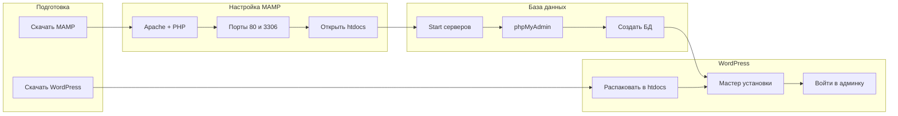

# Локальный WordPress на macOS через MAMP

> Пошаговый гайд: от установки MAMP до первого работающего сайта на WordPress.

Этот репозиторий — подробная инструкция для запуска WordPress локально на Mac. Никакого хостинга и домена не нужно: всё работает прямо на вашем компьютере через **MAMP Free**.

*Рис. 1 — Итоговый результат: WordPress успешно установлен*

---

## Быстрый старт

| Шаг | Действие | Раздел |
|-----|----------|--------|
| 1 | Скачать MAMP и WordPress | [docs/01-prerequisites.md](docs/01-prerequisites.md) |
| 2 | Установить MAMP | [docs/02-install-mamp.md](docs/02-install-mamp.md) |
| 3 | Настроить MAMP (Apache, порты, htdocs) | [docs/03-configure-mamp.md](docs/03-configure-mamp.md) |
| 4 | Создать базу данных | [docs/04-create-database.md](docs/04-create-database.md) |
| 5 | Установить WordPress | [docs/05-install-wordpress.md](docs/05-install-wordpress.md) |
| 6 | Войти в админку | [docs/06-first-launch.md](docs/06-first-launch.md) |

---

## Видеоматериал

Если удобнее смотреть, а не читать — есть видео по той же теме:

**[Установка WordPress на MAMP (YouTube)](https://www.youtube.com/watch?v=OwnwrO6Ub28&t=1s)**

Текстовый гайд в этом репозитории дополняет видео: здесь есть пояснения «почему именно так», таблицы и решение типичных проблем.

---

## Что понадобится

- **macOS** 12 Monterey или новее (Apple Silicon или Intel)
- **~500 МБ** свободного места на диске
- **Браузер** (Safari, Chrome, Firefox — любой)
- **Интернет** — для скачивания MAMP и WordPress

---

## Как устроен процесс

---

## Оглавление

| № | Раздел | Описание |
|---|--------|----------|
| 01 | [Подготовка](docs/01-prerequisites.md) | Ссылки на скачивание, видео, что понадобится |
| 02 | [Установка MAMP](docs/02-install-mamp.md) | Скачивание и установка MAMP Free |
| 03 | [Настройка MAMP](docs/03-configure-mamp.md) | Apache, PHP, порты 80/3306, папка htdocs |
| 04 | [База данных](docs/04-create-database.md) | Запуск серверов, phpMyAdmin, создание БД |
| 05 | [Установка WordPress](docs/05-install-wordpress.md) | Распаковка файлов, подключение к БД |
| 06 | [Первый запуск](docs/06-first-launch.md) | Завершение установки и вход в админку |
| 99 | [Решение проблем](docs/99-troubleshooting.md) | Частые ошибки и их исправление |

---

## Важные параметры

Эти значения используются на протяжении всего гайда:

| Параметр | Значение |
|----------|----------|
| Сайт | `http://localhost/название-вашей-папки/` |
| Apache (веб-сервер) | порт `80` |
| MySQL (база данных) | порт `3306` |
| phpMyAdmin | `http://localhost/phpMyAdmin/` |
| Папка сайтов (htdocs) | `/Applications/MAMP/htdocs/` |
| Логин MySQL | `root` |
| Пароль MySQL | `root` |
| Database Host в WordPress | `localhost` |

---

## Частые проблемы

Столкнулись с ошибкой? Загляните в [docs/99-troubleshooting.md](docs/99-troubleshooting.md) — там собраны типичные ситуации, в том числе если порт 80 или 3306 уже занят.

---

## Лицензия

MIT — см. [LICENSE](LICENSE).
