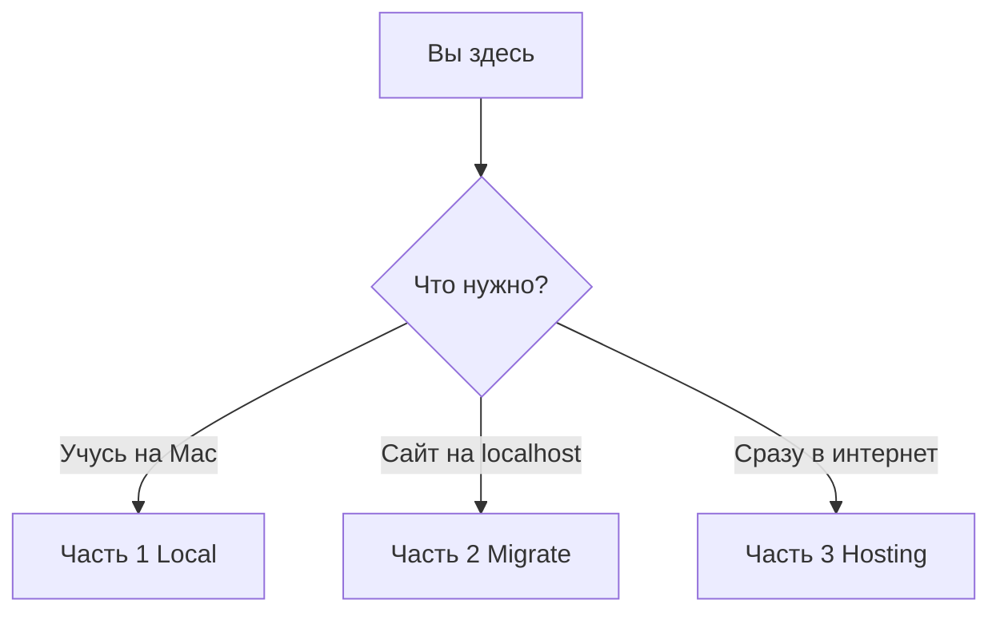

# WordPress на macOS: локально и в интернете


Открытый пошаговый гид на русском: WordPress на Mac, перенос на хостинг или установка сразу в интернете.


---

## С чего начать

Выберите **один** путь — дальше гайд ведёт по шагам, как по дереву:



| Ваша ситуация | Куда | Время |
|---------------|------|-------|
| **Нет сайта, учусь на Mac** | **[→ Часть 1: Local](docs/local/README.md)** | ~30 мин |
| **Сайт на localhost, выкладываю** | **[→ Часть 2: Migrate](docs/migrate/README.md)** | ~45 мин |
| **Сразу на хостинг, без MAMP** | **[→ Часть 3: Hosting](docs/hosting/README.md)** | ~30 мин |

Полный указатель шагов: **[docs/README.md](docs/README.md)**

Ошибки и альтернативные способы (FTP, плагин) — в **README каждой части**.

---

## Что это

Документация с чеклистами и скриншотами — не код сайта.

| Часть | Суть |
|-------|------|
| **Local** | WordPress на Mac (MAMP) |
| **Migrate** | Перенос готового localhost-сайта на хостинг |
| **Hosting** | WordPress с нуля на хостинге |

---

## Кому подходит

Новички на **macOS**, русский язык, бесплатный стек (MAMP + учебный хостинг). Опыт кода не нужен.

---

## Структура репозитория

```
docs/local/     — 3 шага + troubleshooting
docs/migrate/   — 6 шагов + appendix (FTP, плагин) + troubleshooting
docs/hosting/   — 4 шага + troubleshooting
```

---

## Как устроен гайд

В каждом шаге: **Сделайте** → **Проверка** → пояснения в `<details>` → ссылка на troubleshooting.

В шапке: `Шаг N из M` и кнопки **← Назад** / **Далее →**.

---

## Участие

[CONTRIBUTING.md](CONTRIBUTING.md) · [LICENSE](LICENSE)
