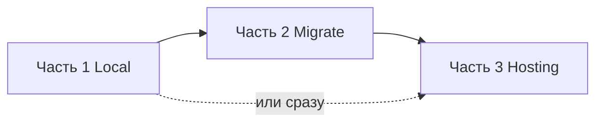

# WordPress на macOS: локально и в интернете


Открытый пошаговый гид на русском: установить WordPress на Mac через MAMP, перенести готовый сайт на хостинг или (скоро) поднять WordPress сразу в интернете.


---

## Что это

Репозиторий — **не код сайта**, а документация с чеклистами, скриншотами и схемами. Три части покрывают полный путь от нуля до публичного сайта:

| Часть | Суть |
|-------|------|
| **Local** | WordPress на вашем Mac (MAMP) |
| **Migrate** | Перенос готового localhost-сайта на хостинг |
| **Hosting** | Установка с нуля на хостинге без MAMP *(в разработке)* |

---

## Кому подходит

- Новички без опыта в веб-разработке
- Пользователи **macOS** (Apple Silicon или Intel)
- Те, кто хочет **бесплатный** стек: MAMP Free + бесплатный учебный хостинг
- Школьники, студенты, самоучки — гайд написан простым языком

Опыт программирования не нужен. Нужно уметь скачивать файлы, открывать браузер и следовать чеклисту.

---

## Что нужно заранее

| Требование | Зачем |
|------------|-------|
| Mac с macOS 12+ | MAMP и гайд рассчитаны на Mac |
| ~500 МБ на диске | MAMP + WordPress |
| Интернет | Скачивание и (для части 2) хостинг |
| 30–45 минут | Первая установка или перенос |

---

## Куда идти



| Ваша ситуация | Часть | Время | Старт |
|---------------|-------|-------|-------|
| Сайта ещё нет, учусь на Mac | **1 — Local** | ~30 мин | [docs/local/README.md](docs/local/README.md) |
| Сайт уже на `localhost`, хочу в интернет | **2 — Migrate** | ~45 мин | [docs/migrate/README.md](docs/migrate/README.md) |
| Хочу сразу на хостинг, без MAMP | **3 — Hosting** | скоро | [docs/hosting/README.md](docs/hosting/README.md) |

Полный указатель всех шагов: **[docs/README.md](docs/README.md)**

---

## Структура репозитория

```
mamp-wordpress-guide/
├── README.md                 ← вы здесь
├── CONTRIBUTING.md           ← как дополнять гайд
├── docs/
│   ├── README.md             ← навигатор по всем шагам
│   ├── local/                ← Часть 1: Mac + MAMP
│   ├── migrate/              ← Часть 2: перенос на хостинг
│   └── hosting/              ← Часть 3: скоро
└── assets/images/
    ├── local/                ← скриншоты части 1
    ├── migrate/              ← скриншоты части 2 (пополняется)
    └── hosting/
```

---

## Три части подробно

### Часть 1 — Local

| | |
|---|---|
| **Что делаете** | Устанавливаете MAMP, создаёте базу, ставите WordPress, входите в админку |
| **Где** | Только на вашем Mac |
| **Зачем** | Учёба, разработка, тесты — без домена и оплаты хостинга |
| **Старт** | [docs/local/README.md](docs/local/README.md) |

Шаги: [01-before](docs/local/01-before.md) → [02-mamp](docs/local/02-mamp.md) → [03-wordpress](docs/local/03-wordpress.md)

### Часть 2 — Migrate

| | |
|---|---|
| **Что делаете** | Бэкап, экспорт SQL, загрузка ZIP через File Manager, настройка `wp-config`, замена URL |
| **Где** | Mac + панель хостинга в браузере |
| **Зачем** | Опубликовать локальный сайт в интернете |
| **Старт** | [docs/migrate/README.md](docs/migrate/README.md) |

Основной путь — File Manager + ZIP. FTP и плагин — в [appendix](docs/migrate/appendix-ftp.md).

### Часть 3 — Hosting

| | |
|---|---|
| **Что будет** | WordPress с нуля на хостинге, без MAMP |
| **Статус** | В разработке |
| **Старт** | [docs/hosting/README.md](docs/hosting/README.md) |

---

## Как устроен гайд

Каждый шаговый файл следует одному шаблону:

1. **Сделайте** — только действия, по порядку
2. **Проверка** — что должно получиться
3. **Пояснение** — в свёрнутых блоках `<details>` для любознательных
4. **Если ошибка** — ссылка на [troubleshooting](docs/local/troubleshooting.md) своей части

В README каждой части — **чеклист за 10 минут** и одна **шпаргалка** с параметрами (порты, логины, пути).

---

## Быстрая шпаргалка (часть 1)

| Параметр | Значение |
|----------|----------|
| Сайт | `http://localhost/название-вашей-папки/` |
| Apache | порт `80` |
| MySQL | порт `3306`, логин `root` / пароль `root` |
| htdocs | `/Applications/MAMP/htdocs/` |
| phpMyAdmin | `http://localhost/phpMyAdmin/` |

Полная таблица и видео — в [docs/local/README.md](docs/local/README.md).

---

## Участие

Хотите добавить скриншоты или поправить текст — см. [CONTRIBUTING.md](CONTRIBUTING.md).

---

## Лицензия

MIT — [LICENSE](LICENSE)
