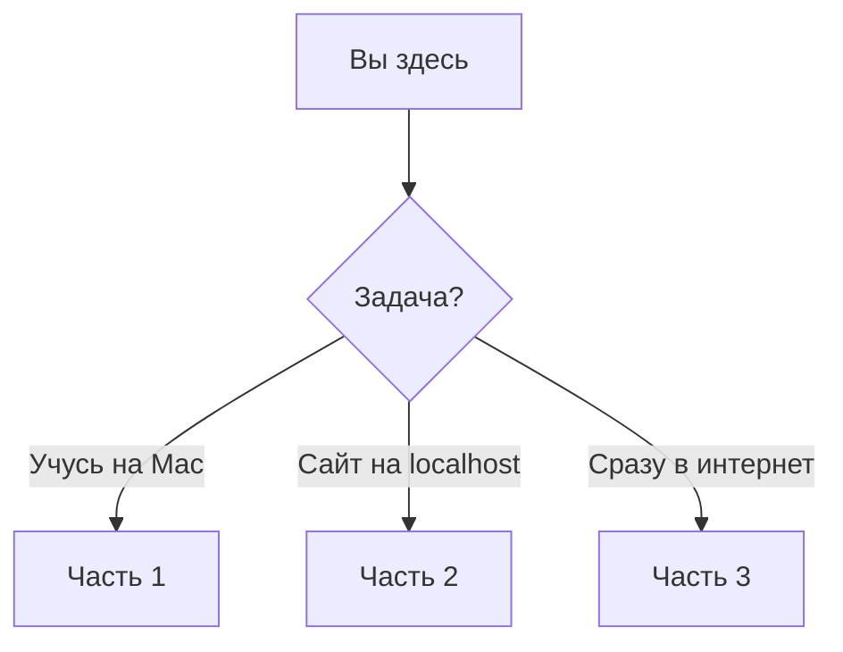

# WordPress на macOS: локально и в интернете


Пошаговый гид на русском: WordPress на Mac, перенос на хостинг или установка сразу в интернете.


---

## С чего начать



| Ситуация | Путь | Время |
|----------|------|-------|
| Нет сайта, Mac + MAMP | **[→ Часть 1](docs/local/README.md)** | ~30 мин |
| Сайт на `localhost` | **[→ Часть 2](docs/migrate/README.md)** | ~45 мин |
| Сразу на хостинг | **[→ Часть 3](docs/hosting/README.md)** | ~30 мин |

Внутри каждой части — шаги **1 → 2 → …** с кнопками «Далее». Развилки (FTP, плагин) — в [Части 2](docs/migrate/README.md).

---

## Структура

```
docs/local/     3 шага + troubleshooting
docs/migrate/   6 шагов + appendix + troubleshooting
docs/hosting/   4 шага + troubleshooting
```

[Полный указатель](docs/README.md) · [Как дополнять гайд](CONTRIBUTING.md) · [LICENSE](LICENSE)
