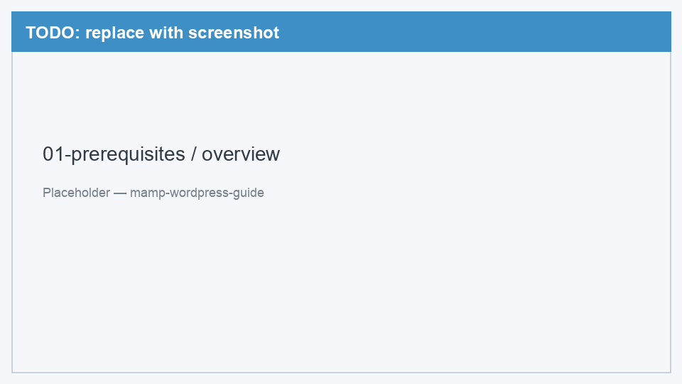

# 01. Подготовка

[← Назад к оглавлению](../README.md) | [Далее: Установка MAMP →](02-install-mamp.md)

Перед установкой убедитесь, что ваш Mac готов к работе. Этот раздел займёт пару минут.

---

## Системные требования

| Требование | Минимум |
|------------|---------|
| Операционная система | macOS 12 Monterey или новее |
| Процессор | Apple Silicon (M1/M2/M3) или Intel |
| Свободное место | ~500 МБ |
| Оперативная память | 4 ГБ (рекомендуется 8 ГБ) |
| Интернет | Нужен для скачивания MAMP и WordPress |

---

## Что такое MAMP?

**MAMP** (Mac, Apache, MySQL, PHP) — это программа, которая превращает ваш Mac в локальный веб-сервер. Она включает всё необходимое для работы WordPress:

- **Apache** — веб-сервер, отдаёт страницы в браузер
- **MySQL** — база данных, хранит контент сайта
- **PHP** — язык, на котором написан WordPress

MAMP Free — бесплатная версия, её достаточно для нашего гайда.

<!-- TODO: заменить placeholder на реальный скриншот -->

*Рис. 1 — Схема: MAMP объединяет Apache, MySQL и PHP на вашем Mac*

---

## Локальный WordPress vs хостинг

| | Локально (MAMP) | На хостинге |
|---|-----------------|-------------|
| Доступ | Только с вашего Mac | Из интернета, у всех |
| Стоимость | Бесплатно | Платно (обычно) |
| Скорость настройки | 15–30 минут | Зависит от хостинга |
| Для чего | Разработка, обучение, тесты | Публичный сайт |

Локальный сайт — отличный способ попробовать WordPress, настроить тему или плагины, не рискуя «боевым» сайтом.

---

## Что скачать заранее

Ничего скачивать заранее не обязательно — мы пройдём это пошагово в следующих разделах. Но полезно знать, откуда брать файлы:

| Что | Ссылка |
|-----|--------|
| MAMP Free | [mamp.info/en/downloads](https://www.mamp.info/en/downloads/) |
| WordPress | [wordpress.org/download](https://wordpress.org/download/) |

> Скачивайте только с официальных сайтов. Сторонние «сборки» могут содержать вредоносный код.

---

## Подробнее: зачем нужен каждый компонент

Apache — веб-сервер

Когда вы открываете `http://localhost:8888/my-site/` в браузере, Apache принимает запрос, находит нужные файлы в папке `htdocs` и отдаёт их обратно. Без веб-сервера браузеру просто нечего показывать.

MySQL — база данных

WordPress хранит статьи, настройки, пользователей и комментарии в базе данных MySQL. Каждый сайт — отдельная база. MAMP запускает MySQL локально на порту `8889`.

PHP — язык WordPress

WordPress написан на PHP. Apache передаёт PHP-файлы интерпретатору, тот выполняет код и возвращает готовый HTML. MAMP включает нужную версию PHP из коробки.

---

[Далее: Установка MAMP →](02-install-mamp.md)
