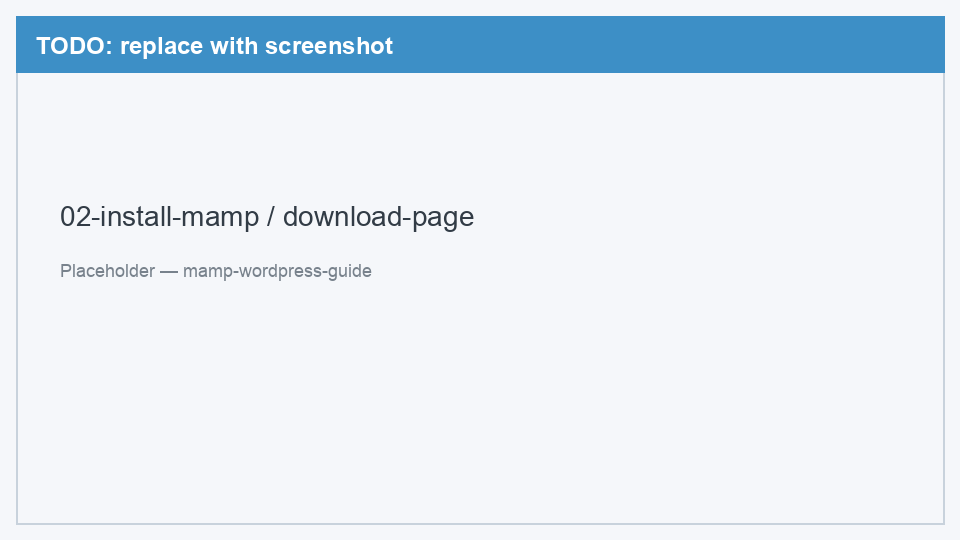
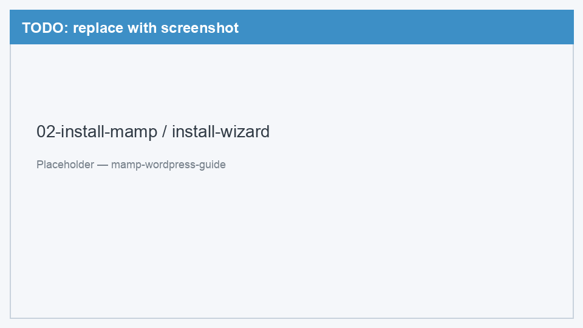
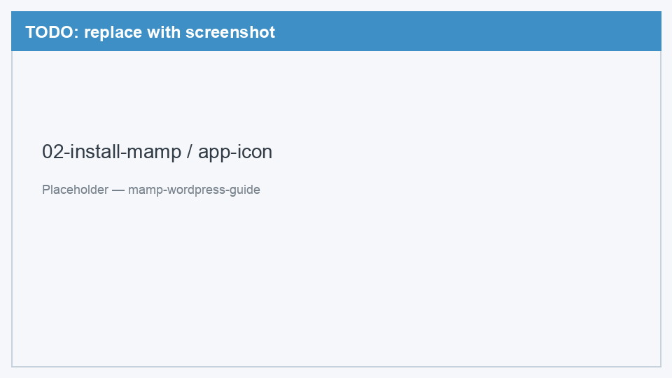

# 02. Установка MAMP

[← Подготовка](01-prerequisites.md) | [Назад к оглавлению](../README.md) | [Далее: Настройка MAMP →](03-configure-mamp.md)

В этом разделе скачаем и установим MAMP Free на Mac.

---

## Шаг 1. Скачать MAMP

1. Откройте официальный сайт: [mamp.info/en/downloads](https://www.mamp.info/en/downloads/)
2. Найдите блок **MAMP** (бесплатная версия, не MAMP PRO)
3. Нажмите **Download** — скачается файл `.pkg`

<!-- TODO: заменить placeholder на реальный скриншот -->

*Рис. 1 — Страница загрузки на mamp.info: выбираем MAMP (Free)*

> Если сайт предлагает MAMP PRO — прокрутите ниже или найдите кнопку для бесплатной версии MAMP.

---

## Шаг 2. Установить MAMP

1. Откройте скачанный файл `MAMP_MAMP_PRO_*.pkg` (двойной клик)
2. Следуйте мастеру установки: **Continue** → **Continue** → **Agree** → **Install**
3. При запросе введите пароль администратора Mac
4. Дождитесь завершения и нажмите **Close**

<!-- TODO: заменить placeholder на реальный скриншот -->

*Рис. 2 — Окно установщика MAMP (.pkg)*

MAMP установится в папку **Applications** (`/Applications/MAMP/`).

---

## Шаг 3. Первый запуск

1. Откройте **Finder** → **Программы** (Applications)
2. Найдите **MAMP** и запустите приложение

<!-- TODO: заменить placeholder на реальный скриншот -->

*Рис. 3 — MAMP в папке Applications*

### Если macOS блокирует запуск (Gatekeeper)

При первом запуске macOS может показать предупреждение «невозможно открыть, так как разработчик не подтверждён»:

1. Откройте **Системные настройки** → **Конфиденциальность и безопасность**
2. Внизу найдите сообщение о MAMP и нажмите **Всё равно открыть**
3. Подтвердите действие

> Это стандартная защита macOS для программ, скачанных из интернета. MAMP — известный и безопасный инструмент.

---

## Проверка

После запуска должно открыться главное окно MAMP с кнопками **Start** и **Stop**. Если окно появилось — установка прошла успешно.

---

[Далее: Настройка MAMP →](03-configure-mamp.md)
