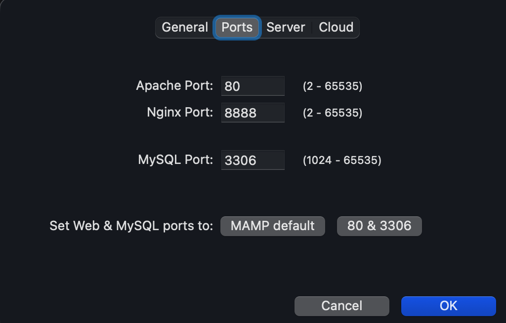
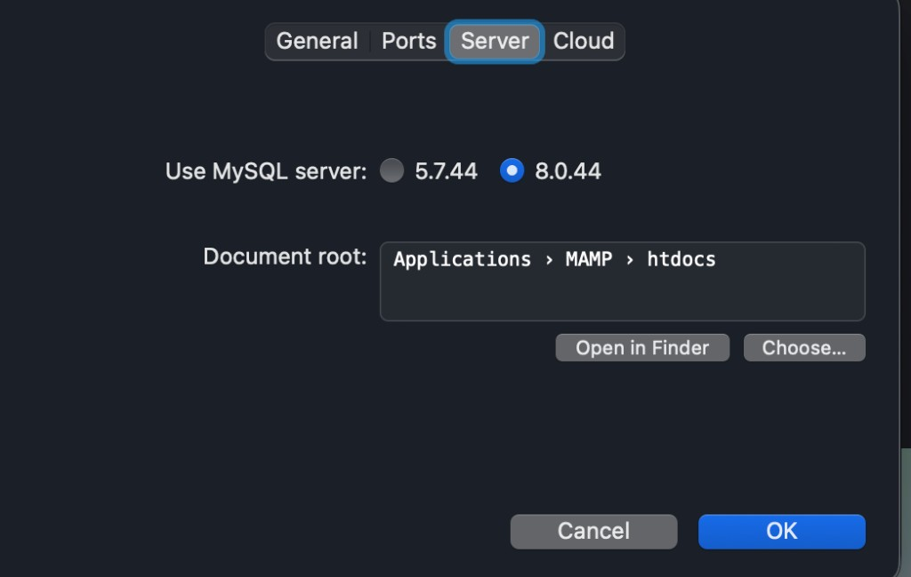

# 03. Настройка MAMP

[← Установка MAMP](02-install-mamp.md) | [Назад к оглавлению](../README.md) | [Далее: База данных →](04-create-database.md)

Перед запуском серверов настроим MAMP для работы с WordPress.

---

## Шаг 1. Открыть MAMP

Запустите приложение **MAMP** (обычная версия, не PRO). Вы увидите главное окно:


*Рис. 1 — Главное окно MAMP: веб-сервер, папка сайтов и версия PHP*

---

## Шаг 2. Выбрать Apache

В блоке **Web server** выберите **Apache** (должна стоять синяя точка напротив Apache, не Nginx).

### Apache или Nginx — что выбрать?

| | Apache | Nginx |
|---|--------|-------|
| WordPress | Рекомендуется: `.htaccess` работает из коробки | Нужна ручная настройка URL rewrite |
| Для кого | Новички, локальная разработка WP | Продакшн, высокие нагрузки |
| В этом гайде | **Выбираем Apache** | Не используем |

> **Почему Apache?** WordPress из коробки использует файл `.htaccess` для красивых ссылок (ЧПУ). Apache понимает его без дополнительной настройки. Nginx быстрее на больших нагрузках, но для локальной разработки WordPress Apache — проще и надёжнее.

---

## Шаг 3. Версия PHP

В выпадающем списке **PHP version** оставьте **версию по умолчанию** — ту, что уже выбрана при первом открытии MAMP (например `8.3.x`).

> **Совет:** не переключайте PHP без причины. Версия по умолчанию в вашей установке MAMP совместима с WordPress. Менять имеет смысл только если конкретный плагин или тема требуют другую версию.

---

## Шаг 4. Настроить порты

Для удобной работы с WordPress выставим стандартные порты.

1. Нажмите **Preferences** (шестерёнка в левом верхнем углу)
2. Перейдите на вкладку **Ports**
3. Установите:
   - **Apache Port:** `80`
   - **MySQL Port:** `3306`
4. Или нажмите кнопку **80 & 3306** внизу окна — порты выставятся автоматически
5. Нажмите **OK**



*Рис. 2 — Вкладка Ports: Apache Port 80, MySQL Port 3306*

### Почему порт 80?

Порт `80` — стандартный HTTP-порт. С ним адрес сайта выглядит чисто:

```
http://localhost/название-вашей-папки/
```

вместо `http://localhost:8888/название-вашей-папки/`.

> **Внимание:** порт 80 может быть занят другой программой (встроенный Apache macOS, Docker и т.д.). Если MAMP не запустится — см. [Решение проблем](99-troubleshooting.md).

### Пароль администратора macOS

После смены Apache Port на `80` MAMP может запросить **пароль администратора Mac** при нажатии **Start**. Это нормально: порты ниже 1024 на macOS требуют повышенных прав. Введите пароль и подтвердите — серверы должны запуститься.

### Почему порт 3306?

Порт `3306` — стандартный порт MySQL. WordPress подключается к базе через `localhost` без указания порта в адресе — так проще и привычнее.

---

## Шаг 5. Открыть папку для сайтов

Сюда позже распакуем WordPress.

1. Снова откройте **Preferences**
2. Перейдите на вкладку **Server**
3. Убедитесь, что выбран **MySQL 8.0** (рекомендуется для WordPress)
4. Нажмите **Open in Finder** рядом с путём Document root
5. Откроется папка `htdocs`:

   ```
   /Applications/MAMP/htdocs/
   ```



*Рис. 3 — Preferences → Server: MySQL 8.0 и кнопка Open in Finder*

Запомните этот путь — все файлы сайта должны лежать здесь.

> **Совет:** можно создать в `htdocs` отдельную папку для вашего сайта — имя папки станет частью URL: `http://localhost/название-вашей-папки/`.

> **Альтернатива:** в Finder нажмите **Переход** → **Переход к папке…** (⌘⇧G) и введите `/Applications/MAMP/htdocs/`.

---

## Что дальше

Настройка завершена. В следующем разделе:

1. Нажмём **Start** в MAMP
2. Создадим базу данных через phpMyAdmin

[Далее: База данных →](04-create-database.md)
