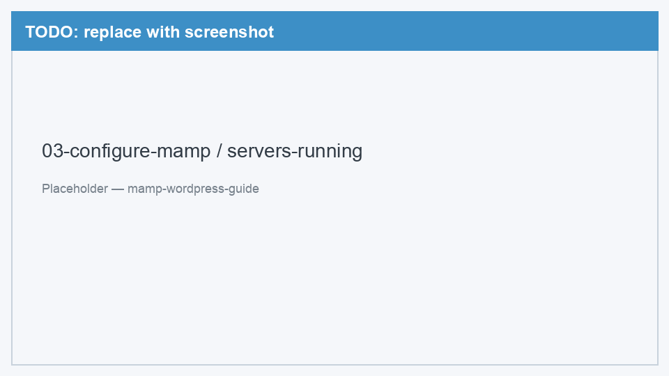
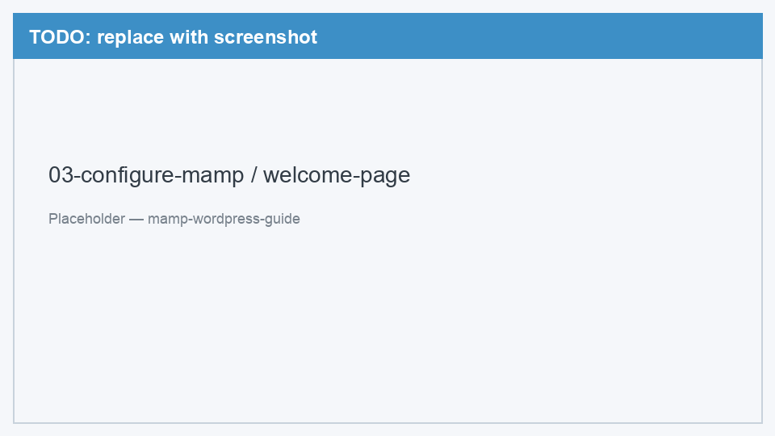

# 03. Настройка MAMP

[← Установка MAMP](02-install-mamp.md) | [Назад к оглавлению](../README.md) | [Далее: База данных →](04-create-database.md)

MAMP установлен — теперь запустим серверы и проверим, что всё работает.

---

## Шаг 1. Запустить серверы

1. Откройте приложение **MAMP** (если ещё не открыто)
2. Нажмите кнопку **Start** в главном окне
3. Дождитесь, пока индикаторы Apache и MySQL станут зелёными

<!-- TODO: заменить placeholder на реальный скриншот -->


*Рис. 1 — Главное окно MAMP с кнопками Start и Stop*

<!-- TODO: заменить placeholder на реальный скриншот -->


*Рис. 2 — Apache и MySQL запущены (зелёные индикаторы)*

> Если серверы не стартуют — см. [Решение проблем](99-troubleshooting.md#apache-не-запускается-port-already-in-use).

---

## Шаг 2. Порты по умолчанию

MAMP Free использует нестандартные порты, чтобы не конфликтовать с другими программами:

| Сервис | Порт | URL |
|--------|------|-----|
| Apache (веб) | `8888` | `http://localhost:8888` |
| MySQL (БД) | `8889` | — |

Порты можно посмотреть в **MAMP → Preferences → Ports**. Менять их не нужно, если всё запускается без ошибок.

<details>
<summary>Подробнее: почему не 80 и 3306?</summary>

Стандартные порты 80 (HTTP) и 3306 (MySQL) часто заняты другими программами — например, встроенным Apache macOS или Docker. MAMP использует 8888 и 8889, чтобы избежать конфликтов.
</details>

---

## Шаг 3. Папка htdocs

Все файлы вашего сайта должны лежать в папке **htdocs**:

```
/Applications/MAMP/htdocs/
```

Именно сюда мы позже распакуем WordPress. Каждая подпапка в `htdocs` — отдельный сайт:

```
htdocs/
├── my-site/          → http://localhost:8888/my-site/
└── another-project/  → http://localhost:8888/another-project/
```

Открыть папку можно через MAMP: **File → Open WebStart page** или в Finder: **Переход → Переход к папке** → введите `/Applications/MAMP/htdocs/`.

---

## Шаг 4. Проверка — страница приветствия MAMP

1. Убедитесь, что серверы запущены (кнопка **Start** нажата)
2. Откройте браузер
3. Перейдите по адресу: [http://localhost:8888/MAMP/](http://localhost:8888/MAMP/)

Должна открыться страница приветствия MAMP с информацией о версиях PHP, MySQL и ссылками на phpMyAdmin.

<!-- TODO: заменить placeholder на реальный скриншот -->


*Рис. 3 — Страница приветствия MAMP в браузере (localhost:8888/MAMP/)*

Если страница открылась — Apache работает. Переходим к созданию базы данных.

---

## Остановка серверов

Когда закончите работу с сайтом, нажмите **Stop** в MAMP — это освободит ресурсы Mac. Перед следующей сессии снова нажмите **Start**.

---

[Далее: База данных →](04-create-database.md)
