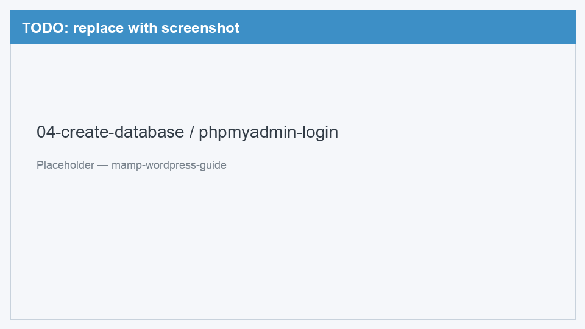
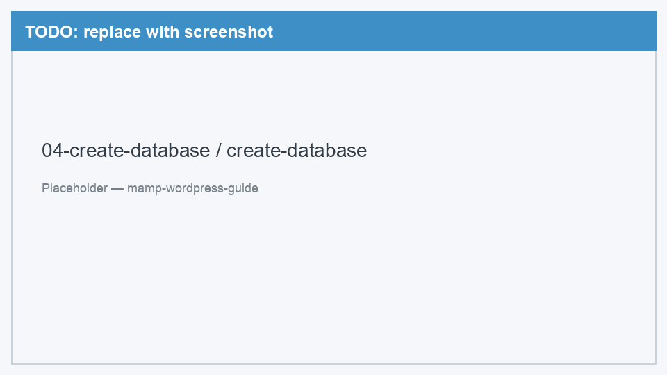
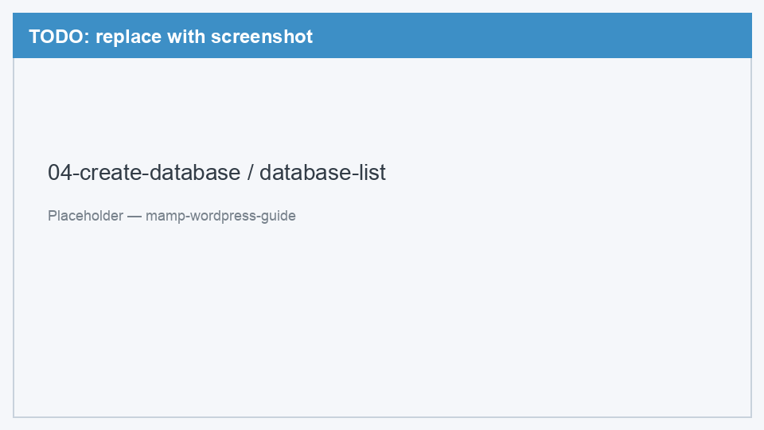

# 04. База данных

[← Настройка MAMP](03-configure-mamp.md) | [Назад к оглавлению](../README.md) | [Далее: Установка WordPress →](05-install-wordpress.md)

WordPress хранит весь контент в базе данных MySQL. Создадим её через phpMyAdmin — веб-интерфейс, который идёт в комплекте с MAMP.

---

## Шаг 1. Открыть phpMyAdmin

1. Убедитесь, что MAMP запущен (серверы **Start**)
2. Откройте браузер
3. Перейдите: [http://localhost:8888/phpMyAdmin/](http://localhost:8888/phpMyAdmin/)

<!-- TODO: заменить placeholder на реальный скриншот -->

*Рис. 1 — Страница входа в phpMyAdmin*

---

## Шаг 2. Войти

Используйте стандартные учётные данные MAMP:

| Поле | Значение |
|------|----------|
| Username | `root` |
| Password | `root` |

Нажмите **Go** (или **Вперёд**).

> Если пароль не подходит — проверьте, что MySQL запущен в MAMP. Пароль можно сбросить в **MAMP → Preferences → MySQL**.

---

## Шаг 3. Создать базу данных

1. В верхнем меню нажмите **Databases** (Базы данных)
2. В поле **Create database** введите имя: `wordpress_local`
3. В выпадающем списке **Collation** выберите: `utf8mb4_unicode_ci`
4. Нажмите **Create**

<!-- TODO: заменить placeholder на реальный скриншот -->

*Рис. 2 — Форма создания базы данных wordpress_local*

Подробнее: зачем utf8mb4_unicode_ci?

`utf8mb4` — кодировка, которая корректно хранит emoji и символы всех языков. `unicode_ci` — правило сортировки для Unicode. WordPress рекомендует именно эту кодировку.

---

## Шаг 4. Проверка

После создания база `wordpress_local` появится в списке слева.

<!-- TODO: заменить placeholder на реальный скриншот -->

*Рис. 3 — wordpress_local в списке баз данных phpMyAdmin*

База пока пустая — WordPress сам создаст нужные таблицы при установке.

---

## Что запомнить

| Параметр | Значение |
|----------|----------|
| Имя базы | `wordpress_local` |
| Пользователь | `root` |
| Пароль | `root` |
| Host (для WordPress) | `localhost:8889` |

Эти данные понадобятся на следующем шаге — при установке WordPress.

---

[Далее: Установка WordPress →](05-install-wordpress.md)
