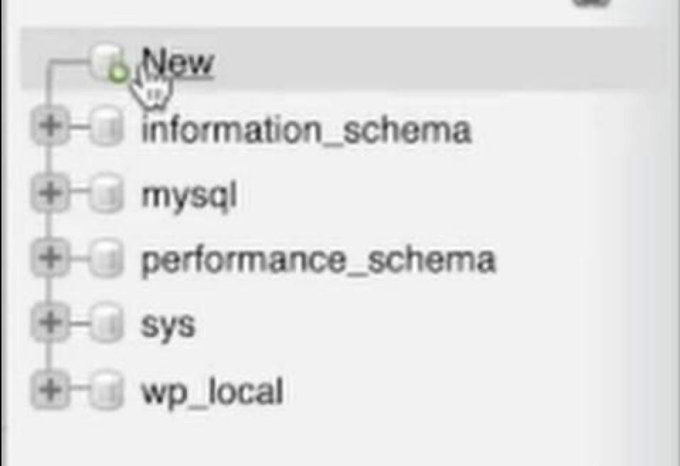

# 04. Создание базы данных

[← Настройка MAMP](03-configure-mamp.md) | [Назад к оглавлению](../README.md) | [Далее: Установка WordPress →](05-install-wordpress.md)

WordPress хранит весь контент в базе данных MySQL. Сейчас запустим серверы и создадим пустую базу.

---

## Шаг 1. Запустить серверы

1. В главном окне MAMP нажмите **Start**
2. Дождитесь, пока индикаторы Apache и MySQL станут зелёными
3. Автоматически откроется страница WebStart в браузере:

   ```
   http://localhost/MAMP/?language=English
   ```

   Язык страницы может отличаться — это не важно.

> Если страница не открылась — перейдите вручную по адресу `http://localhost/MAMP/`.

---

## Шаг 2. Открыть phpMyAdmin

На странице WebStart найдите выпадающий список **MySQL** и выберите **phpMyAdmin**:


*Рис. 1 — На странице MAMP WebStart: MySQL → phpMyAdmin*

На этой же странице указаны учётные данные для подключения:

| Параметр | Значение |
|----------|----------|
| Host | `localhost` / `127.0.0.1` |
| Port | `3306` |
| Username | `root` |
| Password | `root` |

Эти данные понадобятся при установке WordPress.

---

## Шаг 3. Создать новую базу данных

В левой панели phpMyAdmin нажмите **New** (вверху списка баз):



*Рис. 2 — Боковое меню phpMyAdmin: нажмите New*

---

## Шаг 4. Ввести имя и создать

1. В поле **Database name** введите имя базы, например:

   ```
   wordpress
   ```

2. В выпадающем списке кодировки выберите `utf8mb4_unicode_ci` (рекомендуется) или `utf8_general_ci`
3. Нажмите **Create**


*Рис. 3 — Ввод имени базы данных и нажатие Create*

> **Совет:** запомните или запишите имя базы — оно понадобится на следующем шаге. Можно использовать любое имя латиницей, например `wordpress`, `wp_local`, `my_site`.

> **Почему utf8mb4?** Кодировка `utf8mb4_unicode_ci` поддерживает все символы Unicode, включая эмодзи. `utf8_general_ci` тоже работает для локальной разработки.

---

## Итого

| Параметр | Значение |
|----------|----------|
| Имя базы | то, что вы ввели (например `wordpress`) |
| Пользователь | `root` |
| Пароль | `root` |
| Сервер (host) | `localhost` |
| Порт | `3306` |

База создана. Переходим к установке WordPress.

[Далее: Установка WordPress →](05-install-wordpress.md)
