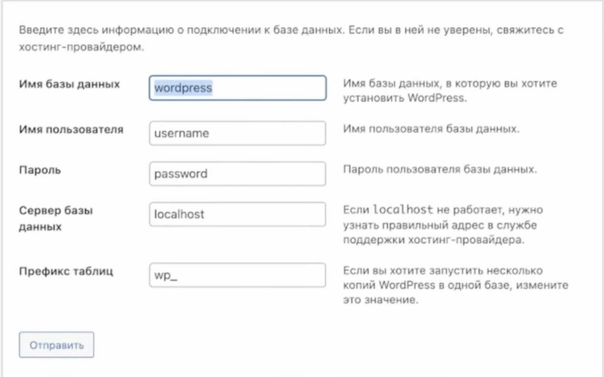

# 05. Установка WordPress

[← База данных](04-create-database.md) | [Назад к оглавлению](../README.md) | [Далее: Первый запуск →](06-first-launch.md)

База данных готова — распакуем WordPress и подключим его к MySQL.

> **Убедитесь, что MAMP запущен** (Apache и MySQL — зелёные индикаторы).

---

## Шаг 1. Распаковать WordPress

1. Откройте скачанный архив `wordpress-x.x.x-ru_RU.zip` (двойной клик)
2. Внутри будет папка `wordpress` с файлами
3. Переименуйте папку `wordpress` в любое удобное имя латиницей, без пробелов (например `my-blog`)
4. Переместите эту папку в `htdocs`, которую открывали в [разделе 03](03-configure-mamp.md#шаг-5-открыть-папку-для-сайтов):

   ```
   /Applications/MAMP/htdocs/название-вашей-папки/
   ```

Внутри должны быть файлы: `index.php`, `wp-config-sample.php`, папки `wp-admin`, `wp-content`, `wp-includes`.

> **Важно:** имя папки = часть URL. Папка `my-blog` → адрес `http://localhost/my-blog/`.

---

## Шаг 2. Открыть сайт в браузере

В браузере (там, где открылась страница MAMP WebStart) смените адрес:

**Было:**
```
http://localhost/MAMP/?language=English
```

**Стало:**
```
http://localhost/название-вашей-папки/
```

Подставьте имя папки, в которую распаковали WordPress.

WordPress покажет экран выбора языка. Выберите **Русский** и нажмите **Продолжить**.

---

## Шаг 3. Подключить базу данных

На экране «Требуется информация о базе данных» нажмите **Вперёд!**, затем заполните поля:

| Поле | Значение |
|------|----------|
| Имя базы данных | имя из [раздела 04](04-create-database.md) (например `wordpress`) |
| Имя пользователя | `root` |
| Пароль | `root` |
| Сервер базы данных | `localhost` |
| Префикс таблиц | `wp_` |



*Рис. 1 — Форма подключения к базе данных. На скриншоте в полях «Имя пользователя» и «Пароль» показаны примеры (`username` / `password`) — **не копируйте их**. Для MAMP введите: пользователь `root`, пароль `root`. Имя базы — то, которое вы создали в phpMyAdmin.*

> **Совет по префиксу:** для одного локального сайта оставьте `wp_` — это стандарт. Кастомный префикс (например `mysite_`) имеет смысл на продакшне для усложнения атак, но локально это не нужно.

Нажмите **Отправить**.

---

## Шаг 4. Запустить установку

Если данные верны, WordPress сообщит, что подключение к базе успешно. Нажмите **Запустить установку**:


*Рис. 2 — WordPress готов к установке: нажмите «Запустить установку»*

WordPress автоматически создаст таблицы в базе данных.

---

## Если WordPress не может подключиться

Проверьте:

- MAMP запущен, MySQL — зелёный индикатор
- Имя базы совпадает с тем, что создали в phpMyAdmin
- Логин `root`, пароль `root`
- Сервер БД — `localhost` (без порта)
- Порт MySQL в MAMP — `3306` (Preferences → Ports)

Подробнее: [Решение проблем](99-troubleshooting.md).

[Далее: Первый запуск →](06-first-launch.md)
