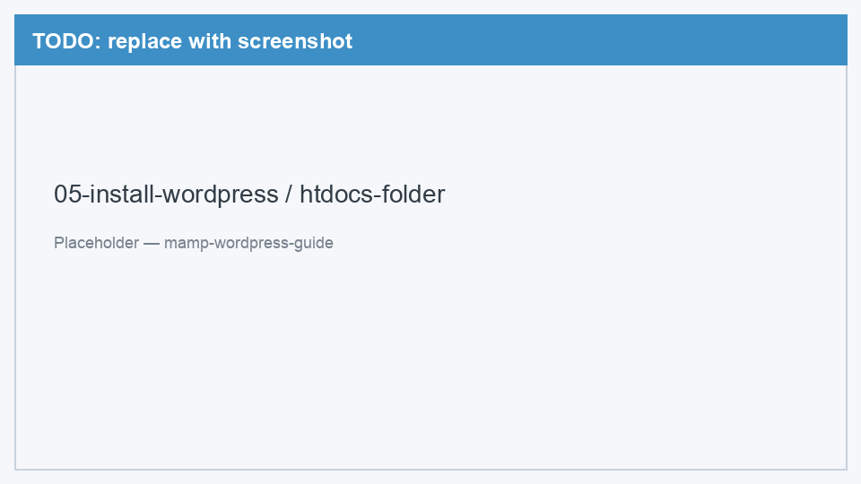
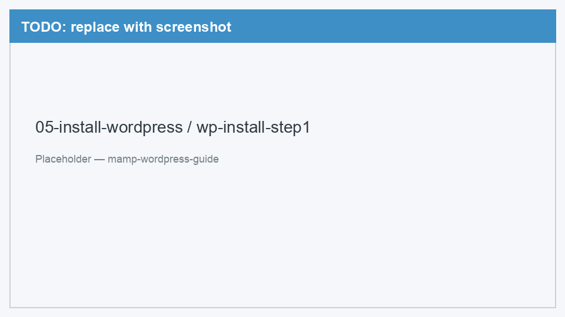
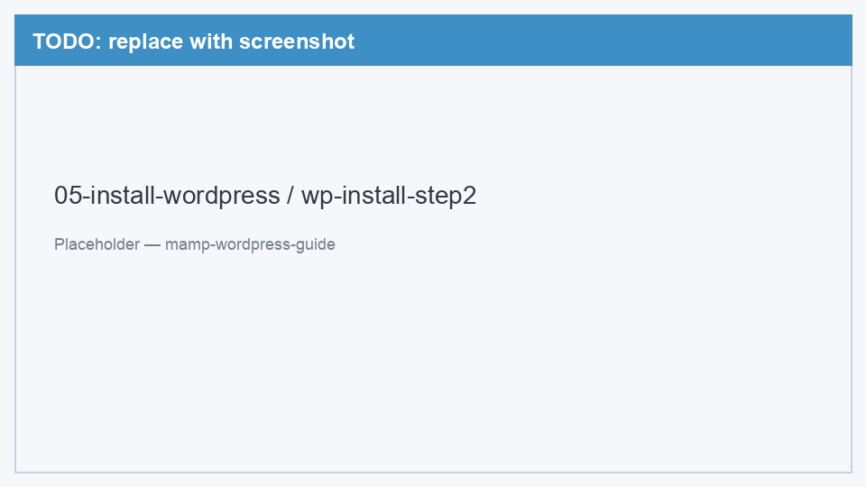

# 05. Установка WordPress

[← База данных](04-create-database.md) | [Назад к оглавлению](../README.md) | [Далее: Первый запуск →](06-first-launch.md)

Скачаем WordPress, положим файлы в htdocs и подключим базу данных.

---

## Шаг 1. Скачать WordPress

1. Откройте [wordpress.org/download](https://wordpress.org/download/)
2. Нажмите **Download WordPress** — скачается архив `.zip`
3. Дождитесь завершения загрузки

> Скачивайте только с wordpress.org — это официальный и безопасный источник.

---

## Шаг 2. Распаковать в htdocs

1. Откройте скачанный архив `wordpress-x.x.x.zip` (двойной клик)
2. Внутри будет папка `wordpress` с файлами
3. Переименуйте папку `wordpress` в `my-site` (или любое имя без пробелов и кириллицы)
4. Переместите папку `my-site` в:

```
/Applications/MAMP/htdocs/my-site/
```

Итоговая структура:

```
/Applications/MAMP/htdocs/my-site/
├── wp-admin/
├── wp-content/
├── wp-includes/
├── wp-config-sample.php
├── index.php
└── ...
```

<!-- TODO: заменить placeholder на реальный скриншот -->


*Рис. 1 — Папка my-site с файлами WordPress в htdocs*

> Имя папки = часть URL. Папка `my-site` → адрес `http://localhost:8888/my-site/`.

---

## Шаг 3. Открыть сайт в браузере

1. Убедитесь, что MAMP запущен
2. Откройте браузер
3. Перейдите: [http://localhost:8888/my-site/](http://localhost:8888/my-site/)

WordPress покажет мастер установки. Выберите язык (например, **Русский**) и нажмите **Продолжить**.

<!-- TODO: заменить placeholder на реальный скриншот -->


*Рис. 2 — Первый экран мастера установки WordPress (выбор языка)*

---

## Шаг 4. Подключить базу данных

На экране «Добро пожаловать» нажмите **Поехали!** и заполните поля:

| Поле | Значение |
|------|----------|
| Название базы данных | `wordpress_local` |
| Имя пользователя | `root` |
| Пароль | `root` |
| Сервер базы данных | `localhost:8889` |
| Префикс таблиц | `wp_` |

<!-- TODO: заменить placeholder на реальный скриншот -->


*Рис. 3 — Форма подключения WordPress к базе данных*

> **Важно:** укажите `localhost:8889`, а не просто `localhost`. Порт `8889` — это MySQL в MAMP.

Нажмите **Отправить**. Если всё верно, WordPress предложит запустить установку — нажмите **Запустить установку**.

<details>
<summary>Если появилась ошибка подключения к БД</summary>

Проверьте:
- MAMP запущен, MySQL работает (зелёный индикатор)
- База `wordpress_local` создана в phpMyAdmin
- В поле «Сервер базы данных» указано `localhost:8889`
- Логин `root`, пароль `root`

Подробнее: [Решение проблем → Error establishing database connection](99-troubleshooting.md#error-establishing-a-database-connection)
</details>

---

## Альтернатива: ручная настройка wp-config.php

Если мастер не может создать файл конфигурации автоматически:

1. Скопируйте `wp-config-sample.php` → `wp-config.php`
2. Откройте `wp-config.php` в текстовом редакторе
3. Замените значения:

```php
define( 'DB_NAME', 'wordpress_local' );
define( 'DB_USER', 'root' );
define( 'DB_PASSWORD', 'root' );
define( 'DB_HOST', 'localhost:8889' );
```

4. Сохраните файл и обновите страницу в браузере

---

[Далее: Первый запуск →](06-first-launch.md)
