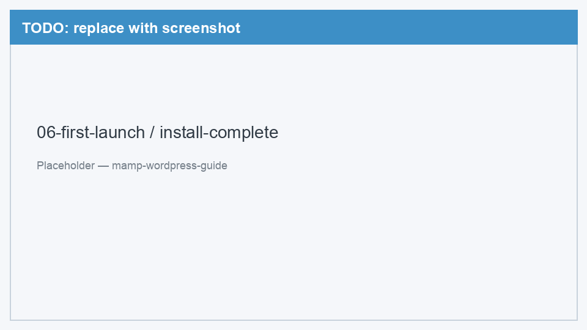
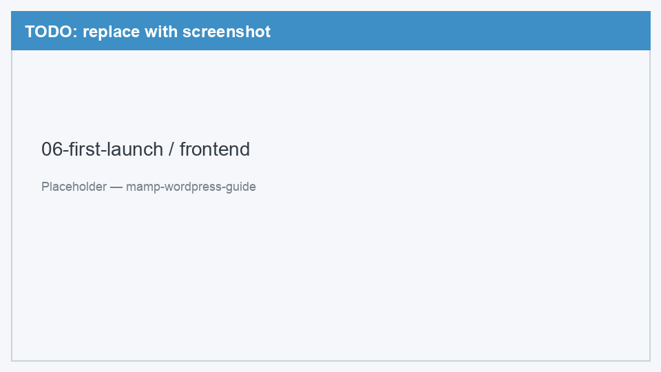
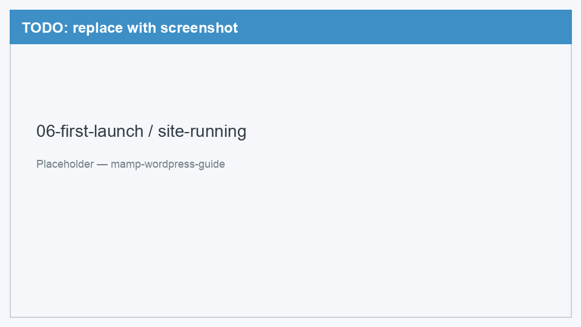
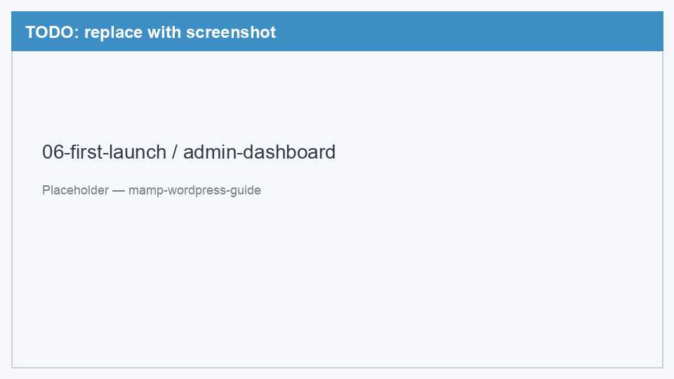

# 06. Первый запуск

[← Установка WordPress](05-install-wordpress.md) | [Назад к оглавлению](../README.md) | [Решение проблем →](99-troubleshooting.md)

Последний шаг — завершить установку и открыть ваш сайт.

---

## Шаг 1. Завершить мастер установки

WordPress попросит заполнить информацию о сайте:

| Поле | Что указать |
|------|-------------|
| Название сайта | Любое — например, «Мой блог» |
| Имя пользователя | Логин для входа в админку (латиница, без пробелов) |
| Пароль | Надёжный пароль (WordPress предложит сгенерировать) |
| Ваш e-mail | Ваш email (для локалки можно любой) |
| Видимость для поисковиков | Можно оставить включённым — для локального сайта не критично |

Нажмите **Установить WordPress**.

<!-- TODO: заменить placeholder на реальный скриншот -->


*Рис. 1 — Экран «Успешно!» после завершения установки WordPress*

---

## Шаг 2. Открыть сайт

Нажмите **Войти** или откройте в браузере:

```
http://localhost:8888/my-site/
```

Вы увидите главную страницу вашего WordPress-сайта с темой по умолчанию.

<!-- TODO: заменить placeholder на реальный скриншот -->


*Рис. 2 — Главная страница WordPress-сайта в браузере*

<!-- TODO: заменить placeholder на реальный скриншот -->


*Рис. 3 — Работающий WordPress-сайт — итог всего гайда*

---

## Шаг 3. Войти в админку

Админ-панель WordPress — место, где вы управляете контентом, темами и настройками:

```
http://localhost:8888/my-site/wp-admin/
```

Введите **имя пользователя** и **пароль**, которые указали при установке.

<!-- TODO: заменить placeholder на реальный скриншот -->


*Рис. 4 — Админ-панель WordPress (Dashboard)*

---

## Готово!

Поздравляем — WordPress работает локально на вашем Mac. Дальше можно:

- **Сменить тему:** Внешний вид → Темы → выбрать и активировать
- **Создать страницу:** Страницы → Добавить новую
- **Написать запись:** Записи → Добавить новую
- **Установить плагин:** Плагины → Добавить новый

---

## Полезные ссылки

| Что | URL |
|-----|-----|
| Сайт (фронтенд) | `http://localhost:8888/my-site/` |
| Админка | `http://localhost:8888/my-site/wp-admin/` |
| phpMyAdmin | `http://localhost:8888/phpMyAdmin/` |
| MAMP welcome | `http://localhost:8888/MAMP/` |

---

## Перед каждой работой

1. Запустите MAMP → **Start**
2. Откройте сайт в браузере

Когда закончите — **Stop** в MAMP, чтобы не расходовать ресурсы.

---

[Решение проблем →](99-troubleshooting.md) | [← Назад к оглавлению](../README.md)
