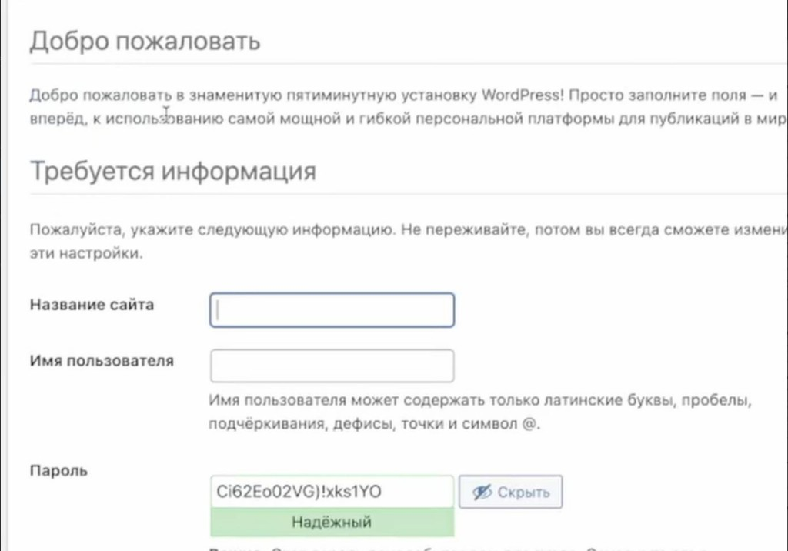
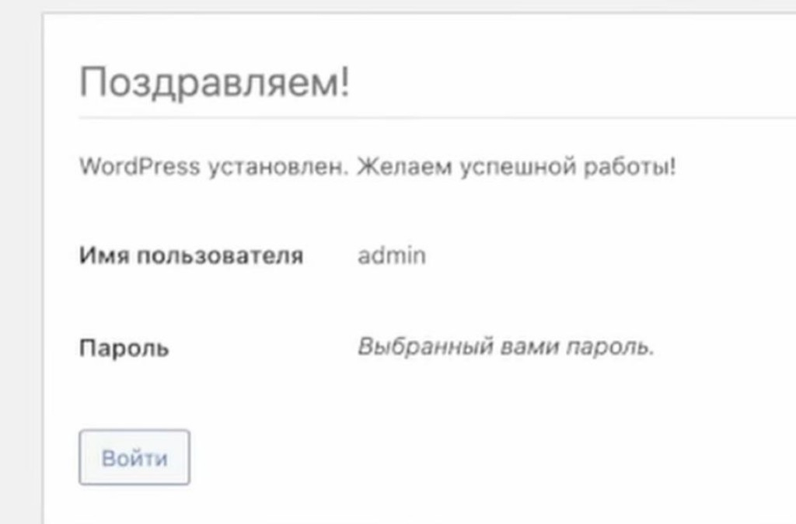

# 06. Первый запуск

[← Установка WordPress](05-install-wordpress.md) | [Назад к оглавлению](../README.md)

Финальный шаг — завершить установку и войти в админку WordPress.

---

## Шаг 1. Заполнить данные сайта

WordPress попросит ввести информацию о сайте:

| Поле | Что указать |
|------|-------------|
| Название сайта | Любое название |
| Имя пользователя | Логин администратора (латиница, без пробелов) |
| Пароль | Надёжный пароль (можно оставить сгенерированный) |
| Ваш e-mail | Любой email |
| Видимость для поисковиков | Можно оставить включённой — сайт локальный |



*Рис. 1 — Заполнение названия сайта, логина и пароля администратора*

Нажмите **Установить WordPress**.

> Для локальной разработки email и видимость для поисковиков не критичны.

---

## Шаг 2. Установка завершена

Появится экран «Поздравляем!» — WordPress установлен. Нажмите **Войти**:



*Рис. 2 — WordPress установлен: нажмите «Войти»*

---

## Шаг 3. Войти в админку

На странице входа введите **логин** и **пароль**, которые указали на предыдущем шаге.

Адрес админки:

```
http://localhost/название-вашей-папки/wp-admin/
```

После входа вы попадёте в панель управления WordPress (дашборд).

---

## Готово!

Гайд по установке WordPress на локальную машину через MAMP завершён.

### Что у вас должно быть в итоге

Запишите эти данные — они понадобятся при работе с сайтом и при переносе на сервер:

| Что | Ваше значение |
|-----|----------------|
| Папка с файлами | `/Applications/MAMP/htdocs/название-вашей-папки/` |
| URL сайта | `http://localhost/название-вашей-папки/` |
| URL админки | `http://localhost/название-вашей-папки/wp-admin/` |
| Имя базы данных | *(как в phpMyAdmin)* |
| Пользователь БД | `root` |
| Пароль БД | `root` |
| Логин WordPress | *(который задали при установке)* |
| Пароль WordPress | *(который задали при установке)* |

> Учётные данные `root` / `root` — **только для локальной разработки**. На внешнем сервере будут другие логин и пароль.

### Полезные адреса

| Что | URL |
|-----|-----|
| Сайт | `http://localhost/название-вашей-папки/` |
| Админка | `http://localhost/название-вашей-папки/wp-admin/` |
| phpMyAdmin | `http://localhost/phpMyAdmin/` |
| MAMP WebStart | `http://localhost/MAMP/` |

### Что можно сделать дальше

- **Включить красивые ссылки (ЧПУ):** Настройки → Постоянные ссылки → выберите «Название записи» → Сохранить изменения
- **Сменить тему:** Внешний вид → Темы
- **Создать страницу:** Страницы → Добавить новую
- **Написать запись:** Записи → Добавить новую
- **Установить плагин:** Плагины → Добавить новый

### Как запускать сайт в следующий раз

1. Откройте **MAMP** и нажмите **Start**
2. Откройте в браузере `http://localhost/название-вашей-папки/`

Сайт не работает, когда MAMP остановлен.

---

## Часть 2: Перенос на хостинг

Локальный сайт готов — перенесите его в интернет:

**[Перенос WordPress на хостинг →](deploy/README.md)**

---

## Видеоматериал

Если что-то осталось непонятным — можно пересмотреть видео:

**[Установка WordPress на MAMP (YouTube)](https://www.youtube.com/watch?v=OwnwrO6Ub28&t=1s)**

> В видео порты могут отличаться — ориентируйтесь на этот гайд.

---

## Проблемы?

Загляните в [Решение проблем](99-troubleshooting.md).

[← Назад к оглавлению](../README.md)
