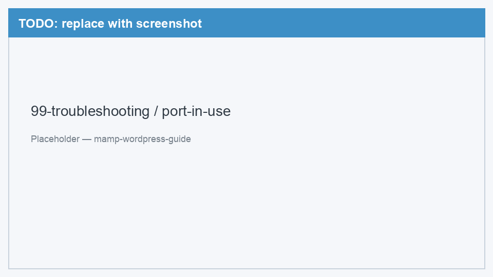
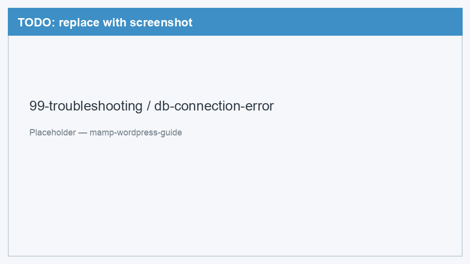
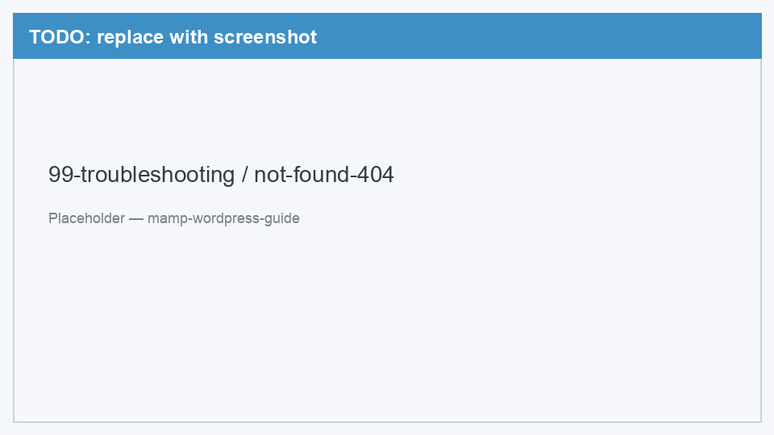

# 99. Решение проблем

[← Первый запуск](06-first-launch.md) | [Назад к оглавлению](../README.md)

Сборник типичных ошибок при работе с MAMP и WordPress на macOS. Если вашей проблемы нет в списке — проверьте, что MAMP запущен и серверы работают (зелёные индикаторы).

---

## Apache не запускается (Port already in use)

**Симптом:** при нажатии **Start** в MAMP появляется ошибка «Apache couldn't be started» или «Port 8888 is already in use».

**Причина:** порт 8888 занят другой программой.

**Решение:**

1. Откройте **MAMP → Preferences → Ports**
2. Нажмите **Set MAMP ports to 8888 & 8889** (сброс к дефолту) или измените Apache Port на другой, например `8880`
3. Если сменили порт — используйте новый в URL: `http://localhost:8880/my-site/`
4. Закройте программы, которые могут занимать порт: Docker, другой локальный сервер, встроенный Apache

<!-- TODO: заменить placeholder на реальный скриншот -->


*Рис. 1 — Ошибка «Port already in use» в MAMP*

<details>
<summary>Найти, что занимает порт (Terminal)</summary>

```bash
lsof -i :8888
```

Команда покажет процесс, использующий порт. Закройте эту программу или смените порт в MAMP.
</details>

---

## Error establishing a database connection

**Симптом:** на странице WordPress белый экран или сообщение «Error establishing a database connection».

**Причина:** WordPress не может подключиться к MySQL.

**Решение — проверьте по порядку:**

1. **MySQL запущен?** В MAMP индикатор MySQL должен быть зелёным
2. **База существует?** Откройте phpMyAdmin — база `wordpress_local` должна быть в списке
3. **Правильный host?** В `wp-config.php` или форме установки должно быть `localhost:8889`, **не** `localhost`
4. **Логин и пароль?** `root` / `root` (стандарт MAMP)
5. **Имя базы?** Точно совпадает с созданной в phpMyAdmin

<!-- TODO: заменить placeholder на реальный скриншот -->


*Рис. 2 — «Error establishing a database connection» в браузере*

---

## Страница не найдена (404)

**Симптом:** браузер показывает «Not Found» или «404» при открытии `http://localhost:8888/my-site/`.

**Причина:** файлы WordPress не в той папке или неверный URL.

**Решение:**

1. Проверьте путь: файлы должны быть в `/Applications/MAMP/htdocs/my-site/`
2. В папке `my-site` должны быть `index.php`, `wp-config.php` (или `wp-config-sample.php`)
3. URL должен совпадать с именем папки: папка `my-blog` → `http://localhost:8888/my-blog/`
4. Убедитесь, что Apache запущен в MAMP

<!-- TODO: заменить placeholder на реальный скриншот -->


*Рис. 3 — Страница 404 Not Found*

---

## Белый экран (White Screen of Death)

**Симптом:** страница полностью белая, без текста ошибки.

**Решение:**

1. Включите отображение ошибок — добавьте в `wp-config.php` перед строкой `/* That's all, stop editing! */`:

```php
define( 'WP_DEBUG', true );
define( 'WP_DEBUG_DISPLAY', true );
```

2. Обновите страницу — должно появиться сообщение об ошибке
3. Частые причины: неверный `wp-config.php`, нехватка памяти PHP, конфликт плагина

---

## phpMyAdmin не открывается

**Симптом:** `http://localhost:8888/phpMyAdmin/` не загружается.

**Решение:**

1. Apache и MySQL должны быть запущены в MAMP
2. Попробуйте открыть через MAMP welcome page: `http://localhost:8888/MAMP/` → ссылка phpMyAdmin
3. Проверьте, что используете порт `8888`, а не `80`

---

## MAMP не открывается (Gatekeeper)

**Симптом:** macOS не даёт запустить MAMP — «разработчик не может быть проверен».

**Решение:**

1. **Системные настройки** → **Конфиденциальность и безопасность**
2. Нажмите **Всё равно открыть** рядом с сообщением о MAMP
3. Альтернатива: правый клик по MAMP → **Открыть** → **Открыть** в диалоге

---

## Сайт работал, но перестал после перезагрузки Mac

**Причина:** MAMP не запускается автоматически при включении Mac.

**Решение:** откройте MAMP и нажмите **Start** перед работой с сайтом.

---

## Не помогло?

Запишите:
- Точный текст ошибки
- Что делали перед появлением ошибки
- Версию macOS и MAMP

Эти данные помогут найти решение быстрее. Раздел будет дополняться по мере появления новых кейсов.

---

[← Назад к оглавлению](../README.md)
