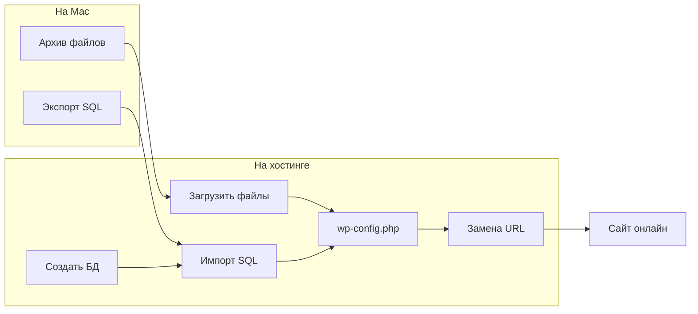

# Часть 2: Перенос сайта с localhost на хостинг

[← Назад к оглавлению репозитория](../../README.md)

Вы прошли [Часть 1](../06-first-launch.md) — WordPress работает локально на Mac через MAMP. Теперь перенесём **уже готовый** сайт в интернет, чтобы его могли открыть другие люди.

> **Время:** обычно 30–60 минут при первом переносе. Не торопитесь — записывайте логины и пароли.

---

## Из чего состоит перенос

WordPress на самом деле — это **две вещи**:

1. **Файлы** — папка с сайтом в `htdocs` (код, темы, картинки)
2. **База данных** — файл `.sql` с записями, настройками и пользователями

На хостинге мы: загрузим файлы → создадим базу → импортируем SQL → настроим `wp-config.php` → заменим адрес `localhost` на домен хостинга.

---

## Два способа переноса

| Путь | Кому подходит | Плюсы | Минусы |
|------|---------------|-------|--------|
| **A. Вручную** (рекомендуем) | Первый раз, учёба | Понимаете, как устроен сайт | Больше шагов |
| **B. Через плагин** | Маленький сайт, нужно быстрее | Меньше действий | All-in-One WP Migration / Duplicator: **большие сайты — платно**; есть лимиты бесплатной версии |

**Этот гайд ведёт по пути A** — шаги 01–09. Плагин описан отдельно: [10-alternative-plugin.md](10-alternative-plugin.md).

---

## Быстрый старт (ручной путь)

| Шаг | Действие | Раздел |
|-----|----------|--------|
| 1 | Подготовка: что должно быть готово | [01-prerequisites.md](01-prerequisites.md) |
| 2 | Выбор хостинга | [02-choose-hosting.md](02-choose-hosting.md) |
| 3 | Бэкап локального сайта | [03-backup-local.md](03-backup-local.md) |
| 4 | Экспорт базы данных с Mac | [04-export-database.md](04-export-database.md) |
| 5 | Загрузка файлов на хостинг | [05-upload-files.md](05-upload-files.md) |
| 6 | Создание базы на хостинге | [06-create-remote-database.md](06-create-remote-database.md) |
| 7 | Импорт SQL на хостинге | [07-import-database.md](07-import-database.md) |
| 8 | wp-config и замена URL | [08-wp-config-and-urls.md](08-wp-config-and-urls.md) |
| 9 | Финальная проверка | [09-final-check.md](09-final-check.md) |

---

## Оглавление

| № | Раздел | Описание |
|---|--------|----------|
| 01 | [Подготовка](01-prerequisites.md) | Что нужно до старта |
| 02 | [Выбор хостинга](02-choose-hosting.md) | Требования и бесплатные варианты |
| 03 | [Бэкап локального сайта](03-backup-local.md) | Копия на случай ошибки |
| 04 | [Экспорт базы данных](04-export-database.md) | SQL из phpMyAdmin на Mac |
| 05 | [Загрузка файлов](05-upload-files.md) | FTP или файловый менеджер |
| 06 | [База на хостинге](06-create-remote-database.md) | Создание БД в панели |
| 07 | [Импорт базы](07-import-database.md) | Загрузка SQL на сервер |
| 08 | [wp-config и URL](08-wp-config-and-urls.md) | Подключение к БД и смена адреса |
| 09 | [Финальная проверка](09-final-check.md) | Чеклист «всё работает» |
| 10 | [Альтернатива: плагин](10-alternative-plugin.md) | Перенос через плагин |
| 99 | [Решение проблем](99-troubleshooting.md) | Ошибки при переносе |

---

## Частые проблемы

[docs/deploy/99-troubleshooting.md](99-troubleshooting.md)

[Начать: Подготовка →](01-prerequisites.md)
