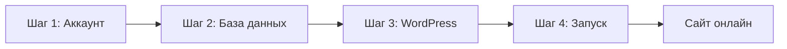

# Часть 3: WordPress сразу на хостинге

[← К оглавлению репозитория](../../README.md)

Установка WordPress **с нуля** в интернете — без MAMP и без переноса с Mac.

> Есть сайт на `localhost`? → [Часть 2: Migrate](../migrate/README.md)  
> Хотите сначала потренироваться на Mac? → [Часть 1: Local](../local/README.md)

---

## Маршрут

---

## Все шаги

| Шаг | Файл | Содержание |
|-----|------|------------|
| 1 | [01-account.md](01-account.md) | Регистрация, панель хостинга |
| 2 | [02-database.md](02-database.md) | Пустая база MySQL |
| 3 | [03-wordpress.md](03-wordpress.md) | Загрузка WP, мастер установки |
| 4 | [04-launch.md](04-launch.md) | Админка, ЧПУ, что записать |
| — | [troubleshooting.md](troubleshooting.md) | Ошибки |

---

## Чеклист за 10 минут

1. Аккаунт на хостинге → [01-account.md](01-account.md)
2. Создать базу MySQL → [02-database.md](02-database.md)
3. Скачать WordPress, загрузить ZIP → [03-wordpress.md](03-wordpress.md)
4. Мастер установки в браузере → [03-wordpress.md](03-wordpress.md)
5. Войти в админку → [04-launch.md](04-launch.md)

**Проблемы:** [troubleshooting.md](troubleshooting.md)

---

## Шпаргалка (заполните)

| Параметр | Ваше значение |
|----------|----------------|
| URL сайта | `http://...` |
| DB_NAME | |
| DB_USER | |
| DB_PASSWORD | |
| DB_HOST | |
| Логин WP | |
| Пароль WP | |

---

**[Начать шаг 1 →](01-account.md)**
