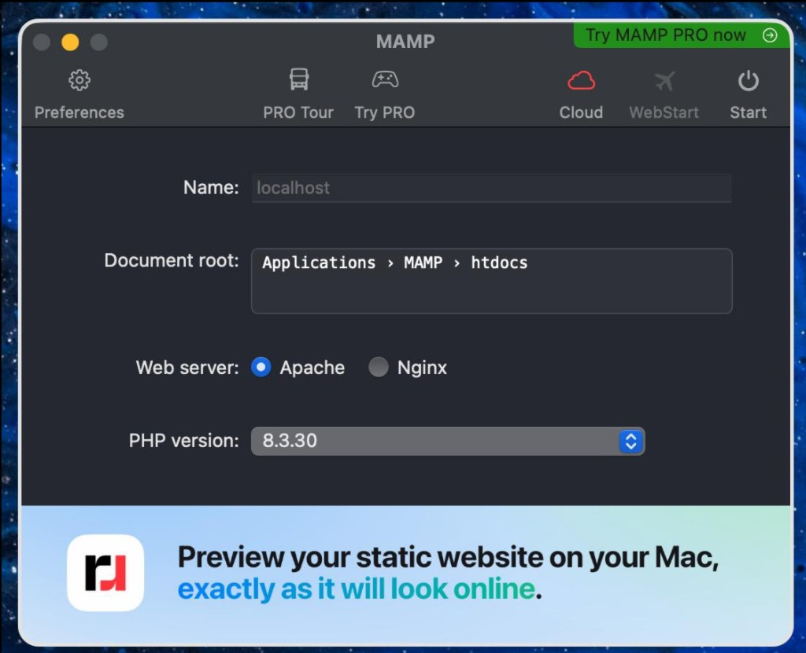
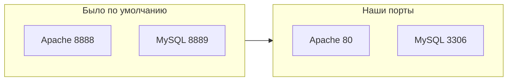

# 02. MAMP: установка и настройка

Вы здесь: [Часть 1](README.md) · **Шаг 2 из 3** · [← Назад](01-before.md) · [Далее →](03-wordpress.md)  
Если ошибка → [troubleshooting.md](troubleshooting.md)

---

## Сделайте

### Установка

1. Откройте `MAMP_*.pkg` → **Продолжить** → **Принимаю** → **Установить** → введите пароль Mac
2. Запустите **MAMP** из Программ (не MAMP PRO)
3. Если macOS блокирует: **Системные настройки** → **Конфиденциальность и безопасность** → **Всё равно открыть**

### Настройка

4. В главном окне выберите **Apache** (не Nginx)
5. **Preferences** → **Ports** → Apache `80`, MySQL `3306` (или кнопка **80 & 3306**) → **OK**
6. **Preferences** → **Server** → MySQL 8.0 → **Open in Finder** → запомните путь `/Applications/MAMP/htdocs/`

**Проверка:** окно MAMP открыто, Apache выбран, порты `80` / `3306`, папка htdocs найдена. **Start пока не нажимайте** — это в следующем шаге.

---

## Пояснение

Зачем Apache, а не Nginx

WordPress использует `.htaccess` для красивых ссылок (ЧПУ). Apache понимает его без дополнительной настройки. Nginx для локальной разработки WP не используем.

Зачем порт 80

С портом `80` адрес чистый: `http://localhost/папка/` вместо `http://localhost:8888/папка/`. Порт 80 может запросить пароль администратора Mac — это нормально для портов ниже 1024.

Версия PHP

Оставьте PHP по умолчанию в MAMP — она совместима с WordPress. Менять без причины не нужно.

---

## Если ошибка

| Симптом | Куда |
|---------|------|
| Порт 80 занят | [troubleshooting.md#port-80](troubleshooting.md#port-80) |
| Порт 3306 занят | [troubleshooting.md#port-3306](troubleshooting.md#port-3306) |
| Apache не стартует | [troubleshooting.md#apache-wont-start](troubleshooting.md#apache-wont-start) |

---

**[Далее: шаг 3 — WordPress →](03-wordpress.md)**
