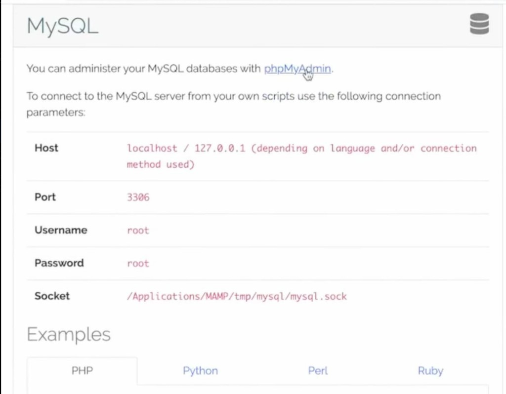
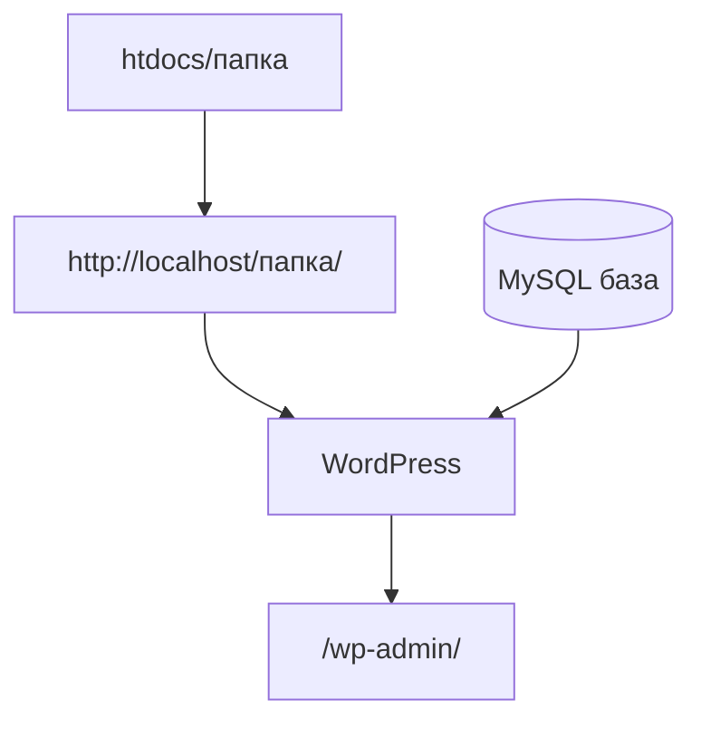

# 03. WordPress: база, установка, вход

[← MAMP](02-mamp.md) | [Часть 1](README.md)

---

## Сделайте

### База данных

1. В MAMP нажмите **Start** — Apache и MySQL зелёные
2. Откройте `http://localhost/MAMP/` → MySQL → **phpMyAdmin**

3. Слева **New** → имя базы (например `wordpress`) → кодировка `utf8mb4_unicode_ci` → **Create**

### Установка WordPress

4. Распакуйте `wordpress-x.x.x-ru_RU.zip`, переименуйте папку `wordpress` (латиница, без пробелов)
5. Переместите в `/Applications/MAMP/htdocs/название-вашей-папки/`
6. В браузере: `http://localhost/название-вашей-папки/` → язык **Русский**
7. **Вперёд!** → заполните БД: имя базы, пользователь `root`, пароль `root`, сервер `localhost`, префикс `wp_`
8. **Отправить** → **Запустить установку**
9. Заполните название сайта, логин, пароль, email → **Установить WordPress** → **Войти**

**Проверка:** админка открывается по `http://localhost/название-вашей-папки/wp-admin/`.

---

## Что записать

| Что | Ваше значение |
|-----|----------------|
| Папка | `/Applications/MAMP/htdocs/название-вашей-папки/` |
| URL сайта | `http://localhost/название-вашей-папки/` |
| Имя базы | *(как в phpMyAdmin)* |
| Логин WP | *(при установке)* |

> `root` / `root` — **только локально**. На хостинге будут другие данные.

### Полезно после установки

- **ЧПУ:** Настройки → Постоянные ссылки → «Название записи» → Сохранить
- **Следующий запуск:** MAMP → Start → открыть URL сайта

---

## Пояснение

Зачем utf8mb4

Кодировка `utf8mb4_unicode_ci` поддерживает все символы Unicode, включая эмодзи.

Имя папки = часть URL

Папка `my-blog` → адрес `http://localhost/my-blog/`. Внутри должны быть `index.php`, `wp-admin`, `wp-content`, `wp-includes`.

Про скриншот формы БД

На скриншоте в полях могут быть примеры `username` / `password` — **не копируйте**. Для MAMP: `root` / `root`.

---

## Если ошибка

| Симптом | Куда |
|---------|------|
| Ошибка соединения с БД | [troubleshooting.md#db-connection](troubleshooting.md#db-connection) |
| 404 на сайте | [troubleshooting.md#page-404](troubleshooting.md#page-404) |
| phpMyAdmin не открывается | [troubleshooting.md#phpmyadmin](troubleshooting.md#phpmyadmin) |

---

## Дальше

**[Часть 2: перенос на хостинг →](../migrate/README.md)**

[← Часть 1](README.md)
