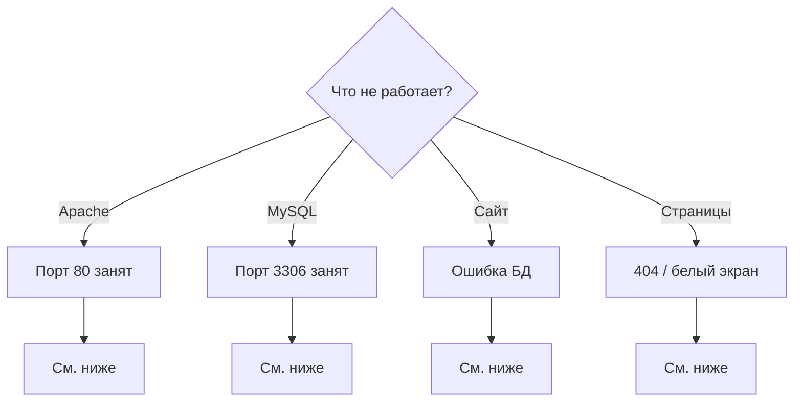

# Решение проблем (локально)

[← Часть 1](README.md)

Перед поиском решения: MAMP запущен, Apache и MySQL — зелёные.



---

<a id="port-80"></a>

## Port 80 занят

**Симптом:** MAMP не запускает Apache — порт `80` занят.

**Решение:**

1. `sudo lsof -i :80` — кто занимает порт
2. Если встроенный Apache macOS: `sudo apachectl stop`
3. MAMP → **Stop** → **Start**

**Альтернатива:** верните порты `8888` / `8889` в Preferences → Ports. URL: `http://localhost:8888/папка/`, сервер БД: `localhost:8889`.

---

<a id="port-3306"></a>

## Порт 3306 занят

**Симптом:** MySQL не стартует.

**Решение:**

1. `sudo lsof -i :3306`
2. Остановите конфликтующий MySQL или смените порт MySQL в MAMP на `8889`
3. В WordPress укажите `localhost:8889` вместо `localhost`

---

<a id="db-connection"></a>

## Error establishing a database connection

| Причина | Решение |
|---------|---------|
| MySQL не запущен | MAMP → **Start** |
| Неверное имя БД | Проверьте в phpMyAdmin |
| Неверный логин/пароль | `root` / `root` |
| Нестандартный порт | `localhost:8889` если MySQL на 8889 |

Проверьте `wp-config.php`:

```php
define( 'DB_NAME', 'wordpress' );
define( 'DB_USER', 'root' );
define( 'DB_PASSWORD', 'root' );
define( 'DB_HOST', 'localhost' );
```

---

<a id="page-404"></a>

## Страница не найдена (404)

1. Папка в `/Applications/MAMP/htdocs/`
2. Внутри есть `index.php`
3. Имя в URL = имя папки (регистр важен)
4. Apache запущен

---

<a id="white-screen"></a>

## Белый экран

1. В `wp-config.php`: `define( 'WP_DEBUG', true );` и `define( 'WP_DEBUG_DISPLAY', true );`
2. Обновите страницу
3. Часто виноват плагин — удалите из `wp-content/plugins/`
4. Лог: `/Applications/MAMP/logs/php_error.log`

---

<a id="apache-wont-start"></a>

## Apache не стартует

1. Порт 80 (см. [выше](#port-80))
2. Закройте Docker и другие веб-серверы
3. Перезагрузите Mac
4. Лог: `/Applications/MAMP/logs/apache_error.log`

---

<a id="phpmyadmin"></a>

## phpMyAdmin не открывается

1. Apache **и** MySQL запущены
2. Попробуйте `http://127.0.0.1/phpMyAdmin/`
3. Через WebStart: `http://localhost/MAMP/` → phpMyAdmin
4. Порт Apache = `80`

---

<a id="no-styles"></a>

## Сайт без стилей

1. URL: `http://localhost/название-вашей-папки/`
2. Настройки → Общие — оба адреса с правильным localhost

---

## Чеклист

- [ ] MAMP запущен, индикаторы зелёные
- [ ] Порты: Apache `80`, MySQL `3306`
- [ ] База создана в phpMyAdmin
- [ ] Файлы в `htdocs/название-вашей-папки/`
- [ ] `wp-config`: `root` / `root`, host `localhost`

---

[← Часть 1](README.md)
