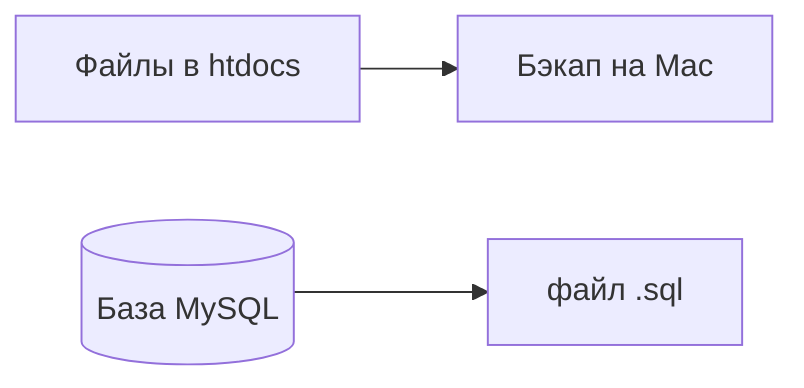

# 01. Подготовка

[← Часть 2](README.md) | [Далее: Загрузка и БД →](02-upload-and-db.md)

---

## Сделайте

### Проверьте локальный сайт

1. Сайт открывается: `http://localhost/название-вашей-папки/`
2. MAMP запущен (для экспорта SQL)
3. Запишите локальный URL **точно** — понадобится при замене (со слэшем или без — запомните вариант)

### Хостинг

4. Зарегистрируйтесь на бесплатном хостинге для учёбы, например [InfinityFree](https://www.infinityfree.com/) или [AwardSpace](https://www.awardspace.com/)
5. Запишите: URL сайта, логин/пароль панели

| Ищите в панели | Зачем |
|----------------|-------|
| MySQL Databases | Создать БД |
| File Manager | Загрузить файлы |
| phpMyAdmin | Импорт SQL |

### Бэкап

6. Скопируйте папку сайта из `/Applications/MAMP/htdocs/` на **Рабочий стол**
7. (Опционально) Локальная админка → Настройки → Постоянные ссылки → «Название записи» → Сохранить

### Экспорт SQL

8. MAMP → **Start**
9. `http://localhost/phpMyAdmin/` → выберите базу слева
10. **Экспорт** → метод **Быстрый**, формат **SQL** → **Вперёд**
11. Сохраните файл, например `wordpress.sql`

**Проверка:** на Рабочем столе копия папки сайта + файл `.sql`.

---

## Пояснение

Минимальные требования хостинга

PHP 8.0+, MySQL/MariaDB, phpMyAdmin, File Manager или FTP, HTTPS желательно. Конкретный бренд не важен — алгоритм одинаковый.

Зачем бэкап

Если перенос на хостинге пойдёт не так, локальный сайт останется целым на Mac.

Почему два файла: папка + SQL

| В файлах | В базе |
|----------|--------|
| Код, темы, картинки | Тексты, настройки, пользователи |

Без SQL на хостинге будет пустой WordPress.

---

## Если ошибка

| Симптом | Куда |
|---------|------|
| Экспортировали не ту базу | Имя слева в phpMyAdmin = `DB_NAME` в `wp-config.php` |
| Не могу найти раздел в панели | Ищите MySQL Databases, File Manager, phpMyAdmin |

---

[Далее: Загрузка и БД →](02-upload-and-db.md)
