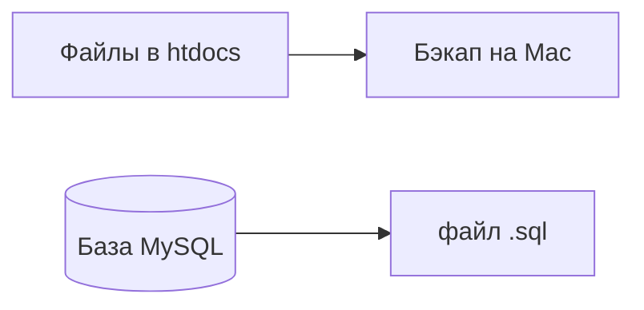

# 01. Подготовка на Mac

Вы здесь: [Часть 2](README.md) · **Шаг 1 из 6** · [Далее →](02-hosting.md)  
Если ошибка → [troubleshooting.md](troubleshooting.md)

---

## Сделайте

### Проверьте локальный сайт

1. Сайт открывается: `http://localhost/название-вашей-папки/`
2. MAMP запущен (Apache и MySQL — зелёные)
3. Запишите локальный URL **точно** — понадобится на шаге 5 (со слэшем в конце или без — запомните вариант)

| Что записать | Ваше значение |
|--------------|----------------|
| URL сайта на Mac | `http://localhost/...` |
| Папка сайта | `/Applications/MAMP/htdocs/...` |

### Бэкап

4. Finder → **Переход** → **Переход к папке…** (⌘⇧G) → `/Applications/MAMP/htdocs/`
5. Скопируйте папку сайта на **Рабочий стол** (⌘C → вставить)
6. (Рекомендуется) Локальная админка → **Настройки** → **Постоянные ссылки** → «Название записи» → **Сохранить**

### Экспорт базы данных

7. MAMP → **Start** (если ещё не запущен)
8. Браузер → `http://localhost/phpMyAdmin/`
9. Слева нажмите **имя вашей базы** (например `wordpress`)
10. Вкладка **Экспорт** (Export) → метод **Быстрый** (Quick) → формат **SQL** → **Вперёд** (Go)
11. Сохраните файл, например `wordpress.sql`, рядом с бэкапом на Рабочем столе

**Проверка:** на Рабочем столе — копия папки сайта **и** файл `.sql`.

---

## Пояснение

Почему два файла: папка + SQL

| В файлах | В базе |
|----------|--------|
| Код, темы, картинки | Тексты, настройки, пользователи |

Без SQL на хостинге будет пустой WordPress.

Зачем бэкап

Если перенос пойдёт не так, локальный сайт на Mac останется целым.

---

## Если ошибка

| Симптом | Куда |
|---------|------|
| Экспортировали не ту базу | Имя слева в phpMyAdmin = `DB_NAME` в `wp-config.php` |
| phpMyAdmin не открывается | [local/troubleshooting.md#phpmyadmin](../local/troubleshooting.md#phpmyadmin) |

---

**[Далее: шаг 2 — аккаунт на хостинге →](02-hosting.md)**
