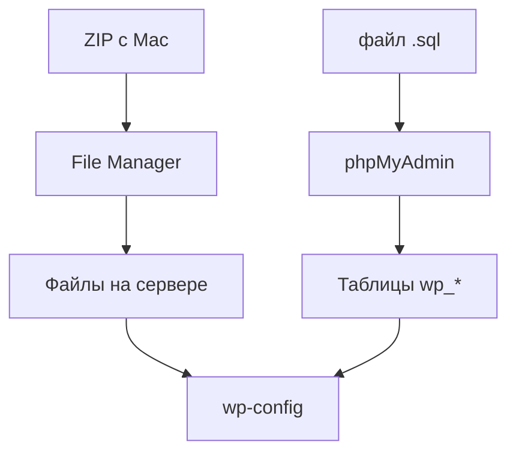

# 02. Загрузка файлов и база данных

[← Подготовка](01-prepare.md) | [Часть 2](README.md) | [Далее: Настройка →](03-configure.md)

---

## Сделайте

### Загрузка файлов (File Manager + ZIP)

1. На Mac: правый клик по папке сайта → **Сжать** → получите ZIP
2. Панель хостинга → **File Manager** → корень сайта (`public_html`, `htdocs` или `www`)
3. **Upload** → выберите ZIP → дождитесь загрузки
4. **Extract** / **Распаковать** → `index.php` должен лежать прямо в `public_html`, не в `public_html/wordpress/wordpress/`

### База на хостинге

5. Панель → **MySQL Databases** → создайте базу (запишите **полное** имя)
6. Создайте пользователя БД + пароль → привяжите к базе → **все привилегии**
7. Запишите 4 поля для `wp-config.php`:

| Поле | Откуда |
|------|--------|
| DB_NAME | панель хостинга |
| DB_USER | панель |
| DB_PASSWORD | панель |
| DB_HOST | панель (**не** `localhost` по привычке с MAMP!) |

### Импорт SQL

8. Панель → **phpMyAdmin** → выберите **пустую** базу слева
9. **Импорт** → выберите `.sql` с Mac → **Вперёд**
10. Слева появились таблицы `wp_*`

**Проверка:** файлы на сервере + таблицы в базе. Порядок шагов 1–4 и 5–10 можно менять.

---

## Пояснение

Куда загружать

Чаще всего `public_html`. Смотрите подсказку хостинга при создании сайта. Загружайте **содержимое** папки сайта, не лишнюю вложенность.

Про DB_HOST

На Mac было `localhost`. На хостинге часто `sql123.hosting.com` или другое значение из панели. Скопируйте, не угадывайте.

Другой способ загрузки

FTP через FileZilla — [appendix-ftp.md](appendix-ftp.md)

---

## Если ошибка

| Симптом | Куда |
|---------|------|
| Сайт в подпапке `/wordpress/` | Переместите файлы на уровень выше |
| SQL слишком большой | [troubleshooting.md#импорт-sql-файл-слишком-большой](troubleshooting.md#импорт-sql-файл-слишком-большой) |
| Ошибка БД после импорта | [troubleshooting.md#error-establishing-a-database-connection](troubleshooting.md#error-establishing-a-database-connection) |

---

[Далее: Настройка →](03-configure.md)
