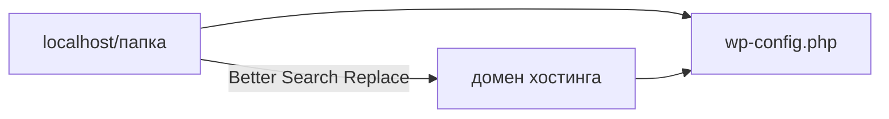

# 03. wp-config и замена URL

[← Загрузка и БД](02-upload-and-db.md) | [Часть 2](README.md) | [Далее: Проверка →](04-check.md)

---

## Сделайте

### wp-config.php

1. File Manager → корень сайта → **Edit** у `wp-config.php`
2. Замените 4 строки на данные из [шага 02](02-upload-and-db.md):

```php
define( 'DB_NAME', 'имя_базы_на_хостинге' );
define( 'DB_USER', 'пользователь_базы' );
define( 'DB_PASSWORD', 'пароль_базы' );
define( 'DB_HOST', 'значение_из_панели' );
```

3. Сохраните → откройте сайт в браузере

### Замена URL

4. Перед `/* That's all, stop editing! */` добавьте (ваш домен):

```php
define( 'WP_HOME', 'http://ваш-домен-хостинга.com' );
define( 'WP_SITEURL', 'http://ваш-домен-хостинга.com' );
```

5. Войдите: `http://ваш-домен-хостинга.com/wp-admin/` (логин/пароль — как на Mac)
6. Плагины → Добавить → **Better Search Replace** → Установить → Активировать
7. Инструменты → Better Search Replace:
   - Search for: `http://localhost/название-вашей-папки` (точно как записали в [01-prepare](01-prepare.md))
   - Replace with: `http://ваш-домен-хостинга.com`
   - Все таблицы → **Run Search/Replace**
8. Удалите строки `WP_HOME` и `WP_SITEURL` из `wp-config.php`
9. Настройки → Постоянные ссылки → **Сохранить** (ничего не меняя)

**Проверка:** сайт открывается по домену хостинга, не редиректит на localhost.



---

## Пояснение

<details>
<summary>Зачем замена URL</summary>

В базе «зашит» старый адрес `http://localhost/...`. Грубая замена текста в `.sql` может сломать сериализованные данные — используйте плагин.
</details>

<details>
<summary>HTTPS</summary>

Если хостинг выдал SSL — везде `https://` вместо `http://`, включая Search Replace и Настройки → Общие.
</details>

---

## Если ошибка

| Симптом | Куда |
|---------|------|
| Ошибка соединения с БД | [troubleshooting.md#db-connection](troubleshooting.md#db-connection) |
| Редирект на localhost | [troubleshooting.md#localhost-redirect](troubleshooting.md#localhost-redirect) |
| Битые картинки | Повторите Search Replace; проверьте `wp-content/uploads` |

---

[Далее: Проверка →](04-check.md)
