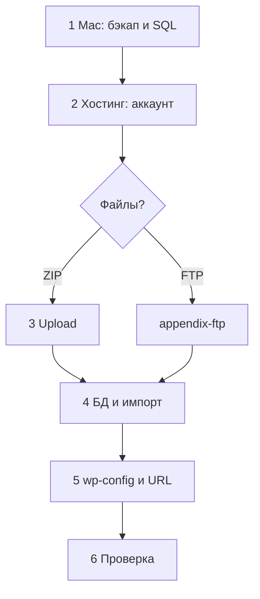

# Часть 2: Перенос с localhost на хостинг

[← К оглавлению репозитория](../../README.md)

Нужен **работающий** сайт на `localhost` (например после [Части 1](../local/README.md)). Переносим файлы + базу на хостинг.

Ошибки → [troubleshooting.md](troubleshooting.md)

---

## Выбор способа

| Путь | Старт |
|------|-------|
| **Ручной** (рекомендуем) | [Шаг 1 →](01-prepare.md) |
| **Плагин** (маленький сайт) | [appendix-plugin.md](appendix-plugin.md) — *отдельная ветка, не шаги 1–6* |

---

## Шаги (ручной путь)

| Шаг | Файл | Содержание |
|-----|------|------------|
| 1 | [01-prepare.md](01-prepare.md) | Бэкап, экспорт SQL, записать localhost URL |
| 2 | [02-hosting.md](02-hosting.md) | Регистрация, панель, где MySQL / File Manager |
| 3 | [03-upload.md](03-upload.md) | ZIP в File Manager *(или [FTP](appendix-ftp.md))* |
| 4 | [04-database.md](04-database.md) | Создать БД, импорт `.sql` |
| 5 | [05-configure.md](05-configure.md) | `wp-config.php`, замена URL |
| 6 | [06-check.md](06-check.md) | Финальная проверка |

---

## Шпаргалка (заполните при переносе)

| Параметр | Локально | Хостинг |
|----------|----------|---------|
| URL | `http://localhost/папка/` | |
| Файлы | `/Applications/MAMP/htdocs/папка/` | `public_html` |
| DB_NAME / USER / PASSWORD / HOST | phpMyAdmin Mac: `root`/`root` | **все 4 поля из панели** |

---

**[Начать шаг 1 →](01-prepare.md)**
