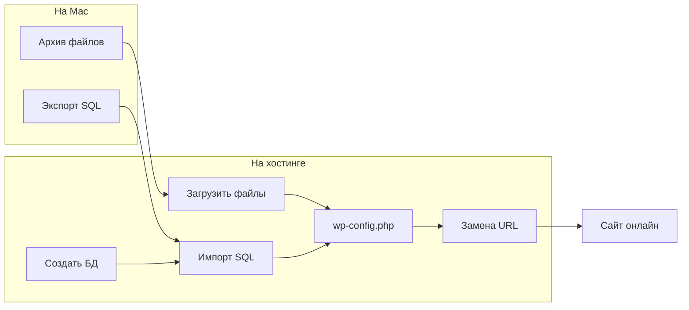

# Часть 2: Перенос сайта с localhost на хостинг

[← К оглавлению репозитория](../../README.md)

Вы прошли [Часть 1](../local/03-wordpress.md) — WordPress работает на Mac. Перенесём **готовый** сайт в интернет.

---

## Чеклист за 10 минут

1. Аккаунт на хостинге → [01-prepare.md](01-prepare.md)
2. Бэкап папки + экспорт SQL → [01-prepare.md](01-prepare.md)
3. ZIP → File Manager → распаковать → [02-upload-and-db.md](02-upload-and-db.md)
4. Создать БД на хостинге (записать 4 поля) → [02-upload-and-db.md](02-upload-and-db.md)
5. Импорт SQL → [02-upload-and-db.md](02-upload-and-db.md)
6. Правка `wp-config.php` → [03-configure.md](03-configure.md)
7. Замена URL (Better Search Replace) → [03-configure.md](03-configure.md)
8. Финальная проверка → [04-check.md](04-check.md)

**Проблемы:** [troubleshooting.md](troubleshooting.md)

*FTP? → [appendix-ftp.md](appendix-ftp.md) · Плагин? → [appendix-plugin.md](appendix-plugin.md)*

---

## Шаги

| Шаг | Файл | Содержание |
|-----|------|------------|
| 1 | [01-prepare.md](01-prepare.md) | Хостинг, бэкап, экспорт SQL |
| 2 | [02-upload-and-db.md](02-upload-and-db.md) | ZIP + File Manager, БД, импорт |
| 3 | [03-configure.md](03-configure.md) | wp-config + замена URL |
| 4 | [04-check.md](04-check.md) | Финальная проверка |

---

## Шпаргалка (заполните при переносе)

| Параметр | Локально (было) | Хостинг (стало) |
|----------|-----------------|-----------------|
| URL сайта | `http://localhost/папка/` | |
| Папка файлов | `/Applications/MAMP/htdocs/папка/` | `public_html` |
| DB_NAME | имя в phpMyAdmin Mac | из панели хостинга |
| DB_USER | `root` | из панели |
| DB_PASSWORD | `root` | из панели |
| DB_HOST | `localhost` | **из панели** (не угадывать!) |

---

[Начать: Подготовка →](01-prepare.md)
