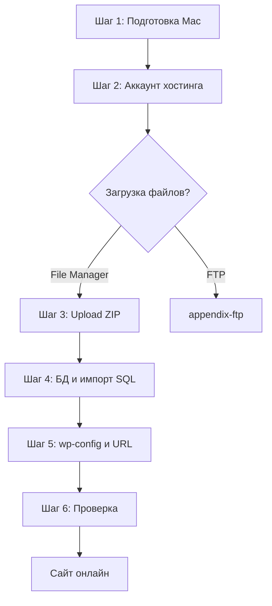

# Часть 2: Перенос сайта с localhost на хостинг

[← К оглавлению репозитория](../../README.md)

Вы прошли [Часть 1](../local/03-wordpress.md) — WordPress работает на Mac. Перенесём **готовый** сайт в интернет.

---

## Выбор способа

| Путь | Кому | Старт |
|------|------|-------|
| **Ручной** (рекомендуем) | Первый раз, хотите понять устройство сайта | [Шаг 1 →](01-prepare.md) |
| **Через плагин** | Маленький сайт, нужно быстрее | [appendix-plugin.md](appendix-plugin.md) *(отдельная ветка, не шаги 1–6)* |

Ошибки на любом шаге → [troubleshooting.md](troubleshooting.md)

---

## Маршрут (ручной путь)

---

## Все шаги

| Шаг | Файл | Содержание |
|-----|------|------------|
| 1 | [01-prepare.md](01-prepare.md) | Бэкап Mac, экспорт SQL |
| 2 | [02-hosting.md](02-hosting.md) | Регистрация, вход в панель |
| 3 | [03-upload.md](03-upload.md) | File Manager + ZIP *(или [FTP](appendix-ftp.md))* |
| 4 | [04-database.md](04-database.md) | Создание БД, импорт SQL |
| 5 | [05-configure.md](05-configure.md) | wp-config + замена URL |
| 6 | [06-check.md](06-check.md) | Финальная проверка |

### Альтернативы и справочник

| Файл | Когда |
|------|-------|
| [appendix-ftp.md](appendix-ftp.md) | Вместо шага 3 — загрузка через FileZilla |
| [appendix-plugin.md](appendix-plugin.md) | Вместо всего ручного пути 1–6 |
| [troubleshooting.md](troubleshooting.md) | Ошибки при переносе |

---

## Чеклист за 10 минут

1. Бэкап + экспорт SQL → [01-prepare.md](01-prepare.md)
2. Аккаунт и панель хостинга → [02-hosting.md](02-hosting.md)
3. ZIP → File Manager → распаковать → [03-upload.md](03-upload.md)
4. Создать БД, импорт SQL → [04-database.md](04-database.md)
5. Правка `wp-config.php` → [05-configure.md](05-configure.md)
6. Замена URL → [05-configure.md](05-configure.md)
7. Финальная проверка → [06-check.md](06-check.md)

---

## Шпаргалка (заполните при переносе)

| Параметр | Локально (было) | Хостинг (стало) |
|----------|-----------------|-----------------|
| URL сайта | `http://localhost/папка/` | |
| Папка файлов | `/Applications/MAMP/htdocs/папка/` | `public_html` |
| DB_NAME | имя в phpMyAdmin Mac | из панели |
| DB_USER | `root` | из панели |
| DB_PASSWORD | `root` | из панели |
| DB_HOST | `localhost` | **из панели** |

---

**[Начать шаг 1 →](01-prepare.md)**
