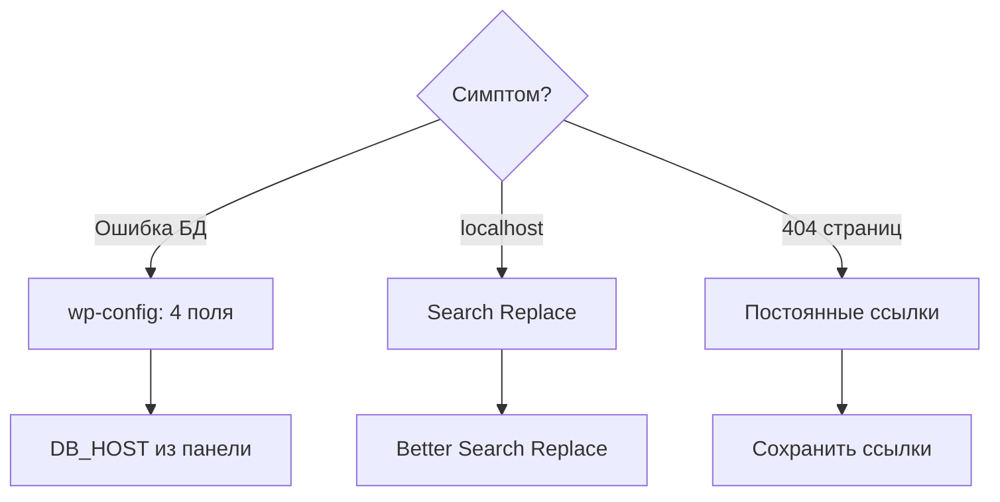

# Решение проблем (перенос)

[← Часть 2](README.md)



---

<a id="db-connection"></a>

## Error establishing a database connection

Проверьте `wp-config.php` на сервере:

| Поле | Частая ошибка |
|------|----------------|
| DB_NAME | Не полное имя из панели |
| DB_USER | Не тот пользователь |
| DB_PASSWORD | Опечатка |
| DB_HOST | `localhost` по привычке с MAMP — **возьмите из панели** |

---

<a id="localhost-redirect"></a>

## Сайт перенаправляет на localhost

1. Временно в `wp-config.php`:

```php
define( 'WP_HOME', 'http://ваш-домен.com' );
define( 'WP_SITEURL', 'http://ваш-домен.com' );
```

2. Войдите в админку
3. Better Search Replace — см. [03-configure.md](03-configure.md)
4. Удалите `WP_HOME` и `WP_SITEURL`

---

<a id="permalinks-404"></a>

## 404 на всех страницах кроме главной

1. Настройки → Постоянные ссылки → **Сохранить**
2. Проверьте `.htaccess` в корне сайта

---

<a id="broken-images"></a>

## Битые картинки

- Повторите Better Search Replace
- Проверьте `wp-content/uploads` на сервере

---

<a id="sql-too-large"></a>

## Импорт SQL: файл слишком большой

1. Сожмите `.sql` в `.zip`
2. Обратитесь в поддержку хостинга
3. Удалите лишние плагины/медиа локально и экспортируйте заново

---

<a id="white-screen"></a>

## Белый экран

1. `WP_DEBUG` и `WP_DEBUG_DISPLAY` в `wp-config.php`
2. Переименуйте папку плагина в `wp-content/plugins/`
3. Логи в панели хостинга (Error Log)

---

<a id="error-500"></a>

## 500 Internal Server Error

- Переименуйте `.htaccess` → `.htaccess.bak` → Постоянные ссылки → Сохранить
- PHP 8.0+ в панели хостинга
- Права: папки `755`, файлы `644`

---

<a id="mixed-content"></a>

## Mixed content (HTTP / HTTPS)

1. Настройки → Общие — оба URL с `https://`
2. Search Replace: `http://домен` → `https://домен`

---

<a id="ftp-filezilla"></a>

## Не могу подключиться по FTP (FileZilla)

| Проблема | Решение |
|----------|---------|
| Connection timeout | Хост, порт, файрвол |
| Login incorrect | Данные из раздела FTP |
| Пассивный режим | FileZilla → FTP → Passive |

---

## Чеклист

- [ ] Файлы в `public_html`, не во вложенной лишней папке
- [ ] `wp-config.php` — 4 поля из панели
- [ ] SQL импортирован
- [ ] URL заменён с localhost
- [ ] Постоянные ссылки сохранены

---

[← Часть 2](README.md)
